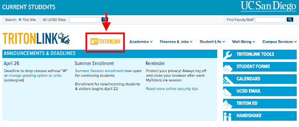
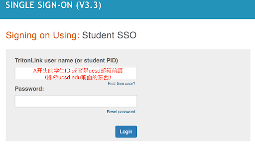
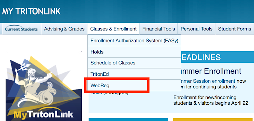
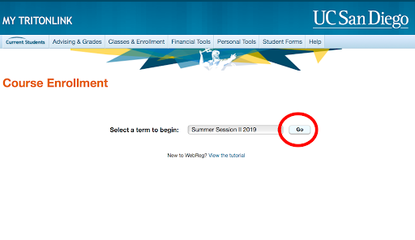

## CHAPTER 10. 注册课程

### 10.1 如何登录WebReg系统

UCSD的选课系统是WebReg。以下是如何从众多操作系统登录的指南。

1. 首先进入[Tritonlink]
2. 点击上方MYTRITONLINK   
3. 输入username/PID和密码登录   
4. 点击上方菜单栏Class & Enrollment的子菜单最后一个就是WebReg   
5. 进入WebReg后选择相应的Term，再点击Go，就会出现如下界面   

---

[Tritonlink]: https://students.ucsd.edu