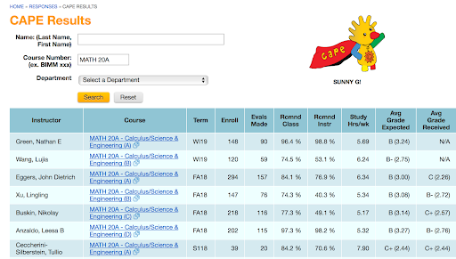

# CHAPTER 10. 注册课程

## 10.1 如何登录WebReg系统

UCSD的选课系统是WebReg。以下是如何从众多操作系统登录的指南。

1. 首先进入[Tritonlink]
2. 点击上方MYTRITONLINK   
3. 输入username/PID和密码登录   
4. 点击上方菜单栏Class & Enrollment的子菜单最后一个就是WebReg   
5. 进入WebReg后选择相应的Term，再点击Go，就会出现如下界面   

## 10.2 选课时间 appointment time

1. 点击上方Appointment time能查看自己可以开始选课的时间
2. 入学前第一次选课，学校会随机分配选课时间。
	1. 之后的选课时间都会根据学分的多少进行分配。学分多的人先选，学分少的人后选。同时选课会分为first pass和second
	   pass两个选课时间，一般间隔一周左右。FIRST PASS的学分上限是11.5个CREDITS，second
	   pass的学分上限是19.5个credits，开学第一天可以加课到22个credits（当然加不加取决于个人）。

## 10.3 找课 search for classes

1. 如果你知道课程所在的专业（比如MATH）或者是课程编号（比如MATH20A）的话，可以直接使用**BASIC SEARCH**
   ，即上图中的搜索栏。如果你想知道哪个教授教哪节课或者其它详细信息，可以使用**ADVANCED SEARCH**。

2. 搜索后会出现课程列表，点击你想了解的课程，可以出现更多信息。右上角的蓝色字体可以作为选课的参考工具：

- Catalog是这门课程的课程简介；
- Prerequisite是可以enroll这门课的条件，如果你没有达到prerequisite的话，是不能上这节课的；
- Resources 里面有更多详细信息的网站；
- Evaluation 也就是CAPE result，里面有以往学生对教授和这节课的评价及平均分。

## 10.4 排课 Plan Classes

1. 查找课程的具体信息后，可以看到这门课的上课时间，地点，总共seats，剩余位置，waitlist人数，教授等信息。

   

	- Building是这门课所在的教学楼，点击楼的名字（比如图中的APM）可以查看教学楼所在的位置。建议大家参考一下
	  楼与楼之间的距离，毕竟UCSD真的很大，如果楼和楼之间近的话就还好，但是有的时候真的会出现课间10分钟从学校这边冲到另一边的可能性。
	- Total Seats是总共多少人可以enroll这节课，Avail Seats是还剩多少个位置，Waitlist Count是现在正在Waitlist中的人数。

2. 如果你想plan这节课就可以点击后面的**plan**。已经plan好的课（由白色表示）可以在下面的Calendar查看日常课表，Final可以查看Final时间安排。
   
3. 右上角的My Schedule可以添加events，比如去gym，参加社团活动等等…

{: .note }
> **Tips**
> 1. 关于教授评价的信息除了CAPE（上面提过的Evaluation）之外，还可以通过rate my professor（https://www.ratemyprofessors.com
	 ）输入教授的名字和看准所在学校查看往届学生对professor的评价。
	 1. 点击https://www.ratemyprofessors.com/ 进入rate my professor
	 2. 点击框中按钮搜索UCSD的教授，点search即可搜索
	 3. 在这个网站上可以看到教授的作业量，难度，需不需要attendance等信息。
> 2. 关于上什么课，要综合major requirement，general education requirement，diversity equity and inclusion
	 requirement几个方面来考虑。可以参考学校给出的针对不同专业学院的学生定制的[four year plan]。

## 10.5 选课 Enroll

1. Appointment time一到，大家就可以进行选课了。对于还有位置的课直接点击后面的Enroll就可以了。（已经enroll的课在下面的list/calendar以深蓝色表示。）

2.如果没位置的话，就要考虑一下是否要waitlist这门课。如果要waitlist，就点waitlist。可以上[facilities.UCSD.edu]
查一下这个教室总共能容纳下多少人，如果整个lecture（所有section加和）Total
Seats小于教室容量的话，很大可能是位置没有全部放出来，随后学校还是会陆续放位置的。按照经验，如果你处在section的前10%还是有希望可以enroll的。
当然也要做好备选课程，以防没有课上。（已经waitlist的课在下面的list/calendar以浅蓝色表示。）有时候学校还会增加section（新增section的total
seats一般是0，不用担心，之后会放出来），所以如果有很想上的课的话，可以时不时去webreg上看一下，说不定会有惊喜。

## 10.6 本科生重要时间及其它

- Week2的周五–加课（add course）的截止时间，申请part-time status；
- Week4的周五–drop class without a “W”的截止时间；
- Week6的周五–drop class with a “W”，更改grading option，更改units 的截止时间；
	- 这也就说明Week6的周五之后课表就没有办法更改了。

{: .note}
> **关于grading options**
> UCSD共分为两种grading option：letter grade（ABCDF）和pass/no pass（俗称pnp）。其中PNP只有过和没过两种可能，PNP只要C-以上就是P。PNP不会计入GPA，而LETTER
> GRADE就会影响GPA了。A+/A 4.0 ，A-3.7 ， B+ 3.3，B 3……以此类推。毕业的时候你总的学分中用pass no
> pass计分的不能超过25%，而专业课必须letter，minor大多需要letter。转掉的学分算是pass，不过不在那25%里面。
> 更改grading options只需要点击栏目后方的change，然后选择新的grading option之后confirm即可。

{: .note}
> **关于drop课**
> DROP WITHOUT A “W”ON TRANSCRIPT就是成绩单上不会显示你drop过这节课，而drop with a
> “W”就是成绩单上会显示你drop过这节课。通常来讲，只要w的数量不要太多，同时不是专业课的话，问题不会太大。但还是建议与advisor聊一下。

{: .note}
> **关于EASy（Enrollment Authorization System）**
> 可以用来申请批准特殊情况，比如想要选课超过22个学分，没达到prerequisite但是还想上这节课等等。

## 10.7 degree audit

在degree audit中可以看到自己完成了专业和学院要求的哪些课，以及还需要上哪些课可以毕业。

1. 点击https://act.UCSD.edu/studentDars/select进入degree audit.
2. 点击框中的按钮开始run audit
   

点击框中按钮看自己的audit

## 10.8 前期AP/IB/A-level转学分

入学前可以使用AP和IB兑换UCSD学分（计入pass/no
pass，即不影响GPA），同时也可以抵换UCSD的课程。但是不同学院对于是否能抵换课程以及可以抵换什么课程有不同的成绩要求。详情可以查看下表。
入学前学分越多，在选课中（除入学第一个quarter选课顺序随机安排外）就会越靠前。但是同时抵掉的lower课多就意味着大一的时候就会接触到upper课程，
建议大家把基础打牢，不然基础不扎实会成为学好upper课程道路上的绊脚石。

除了下面的AP和IB的置换课程表格，一些学院也有自己的置换课程表格，可以google “ucsd ap/ib/a-level +
学院名字”。A-level学校没有统一的表格，但是有些专业，如物理，有置换表。

[AP置换课程表格_2023–24]

[IB置换课程表格_2023–24]

## 10.9 毕业要求

1. **University Requirement**

   每节课都有对应的学分, 绝大多数课都是四分的课。毕业的最低要求是修满180个学分。专业课upper必须上至少48学分。所有的课里需要有至少60
   upper学分。

2. **College Requirement (General Education)**

   只要在毕业前上完所有自己所在学院的GE课程就可以了。关于每个学院的GE要求，学院篇会有详情介绍。

3. **Major Requirement**

   每个学生都必须在完成90个学分以前declare a major/pre-major。不同的专业有不同的要求，具体可以查询不同department的网站。

4. **Diversity，Equity，and Inclusion Requirement**

   UCSD的学生需要有diversity，equity，and inclusion的相关知识。本科生可以只需要在下面网站的list的里面选一节上就可以满足这项的要求。
   这门课只要得到C-以上或者P的成绩，就算通过。[DEI_website]

   主要注意的是这里面的有一些课并不是常年都会有的，所以要选课前注意一下。

5. **The Analytical Writing Program and UC Entry Level Writing Requirement**

   UCSD要求所有本科生（包括国际生）具有英语写作能力。所有大一新生在真正上自己学院的写作课之前，需要先满足大学写作等级要求（Entry
   Level Writing Requirement，简称ELWR）。

- **满足ELWR具体要求**

网站上有更多信息，请前往查看：[ELWR]

注意，没有列在改列表上的相应英语水平能力考试，例如托福，雅思，IGCSE，GCE等都是无法满足ELWR的。若满足上述条件，需在指定日期前讲自己的官方
成绩单（一般是通过考试局，例如College Board等）寄给学校的Admission
Office。具体截止日期为：大学官方成绩单7.1之前，AP/IB/SAT/ACT成绩7.15之前。所以有暑假去补考以满足ELWR想法的同学，需要跟成绩单截止日期对一对了。如果过了截止日期没有提交相应成绩，则视为没有满足ELWR。

- **那么没有满足ELWR会怎么办呢**

所有没有满足ELWR的学生，需要于正式在UCSD上课前（也就是大一正式开学前），网上报名参加ANALYTICAL WRITING PLACEMENT
EXAM（以下简称AWPE），用于检验是否满足大学写作能力要求。AWPE考试的形式类似于新SAT写作和托福写作的结合，需要学生先阅读一篇文章，然后根据题目，结合文章内容给出自己的观点。考试时间为两个半小时，且一般会在两天之内出结果。

通常AWPE会有三种结果。一种是pass，视为满足大学写作水平要求，可以直接上学院写作课。在剩下No Pass的结果中，又分为被分到ANALYTICAL
WRITING PROGRAM 3（以下简称AWP3）系列课程的学生和Analytical Writing Program 4A – 4B （以下简称AWP 4A –
4B）系列课程的学生。其二者本质上的区别是，AWP3会将整个AWP系列课程压缩制一学期完成，而AWP 4A – 4B
在两个学期完成，其余上课内容和要交的作业等都是一样的。AWP
4A-4B的通过率要比AWP3的通过率高。一般AWP系列课程会围绕一些当今社会上比较热点的问题进行讨论，比如21年秋季学期的misinformation，22年秋季学期的California
Dream等。注意，如果是上AWP 4A – 4B 的同学，第二个学期并不是换议题，而是继续第一个学期没有讨论完的同一话题，这点上大家可以不用担心话题的变换速度太快而增大工作量。

- **AWP课程组成**

AWP系列课程主要由课上讨论，课后阅读，写作提炼分析作者观点，及一些大大小小的总结和论证的写作构成，没有QUIZ / MIDTERM /
FINALS。所有的学生需要在自己AWP系列课程结束的时候上交一个PORTFOLIO（AWP3的学生就是一学期结束的时候，AWP 4A – 4B
则是第二个学期结束的时候）。
该portfolio主要包括的写作内容有：

- 一篇FINAL DRAFT的SUMMARY & SYNTHESIS ESSAY: 提出一个问题，并通过总结几个作者的观点来回答这个问题
- 一篇FINAL DRAFT的ARGUMENT ESSAY: 提出一个中心思想，并通过引用几个作者的观点来论证并支持这个中心思想
  以及这两种essay写过的所有drafts （一般三次）。
- 一篇REFLECTIVE OVERVIEW: 主要介绍自己在AWP系列课程上的成长，有什么是做得好的，有什么还需要继续加油等等）
- 一篇在学期快结束时写的IN-CLASS WRITING

Summary & Synthesis Essay和Argument Essay是AWP教学组的教授主要批判这个portfolio的标准，所以一定要好好完成；不过也不用太担心，因为整个课程进行的时间里都可以随时去找教授和导师的Office
Hour修改自己的文章。

在最后一节课上交完这个portfolio以后，一般等2-3个工作日就可以知道自己的结果了。一种是pass，那么恭喜你，可以摆脱AWP，去上学院写作课啦。另一种是No
Pass，一般会被分到AWP3再上一遍AWP的课程，不过鉴于新的学期是新的话题，也不至于太枯燥。需要注意的是，一般AWP应在大一通过并满足ELWR。如果大二还没满足有传言说可能会被劝退，但是目前还没有见过大一结束的时候还没满足的。但是学校设置这门课是不会no
pass为难大家的，所以不需要特别担心过不了awp。只要好好写作文，经常去找教授改作文，一般都没什么太大的问题。

- **关于AWP的学分和GPA机制**

AWP在UCSD的选课系统里显示的是四个学分，不会记入到毕业所需的180个学分里，但是会占用那个学期的选课学分。举个例子，如果这个学期你有四门四学分的课，AWP是你的第五门课，然后你还想加一门四个学分的课，你这个学期的学分就超过了Maximum
Units，需要向学校申请才能加第六门课，因为AWP算你这个学期的四个学分。如果你最后选择没有申请加这第六门课，那么这学期结束的时候，你在Degree
Audits上记入毕业学分的课，其实是4x4=16，因为AWP是不算毕业学分的。同样，AWP也是不计入GPA的。虽然在UCSD的选课系统上会显示take的是Letter
Grade，最后结果也确实会给出一个Letter Grade，但是C以上就可以pass并满足ELWR。本质上AWP其实是一个P/NP的课程，所以大家只要最后PORTFOLIO
RESULTS过C就行了。

## 10.10 Summer Session

[Summer Session website]

UCSD有三种SUMMER SESSION，分别为：

- Summer Session1: 7月3号-8月5号左右，具体日期每年会有点变化；
- Summer Session 2: 8月7号-9月9号，具体日期每年会有点变化；
- Special Session：不同课程时间不同，大部分是在六月底到九月初，也有部分七月底到八月底，六月中到七月中。

其中Summer Session1（ss1）和Summer Session2（ss2）是大家经常上的两种ss，通常有五周，最后一周是final。

- **学费Tuition and Payment**

本科生：$279 per unit，研究生：$349 per unit 。除了学费之外，还有额外的Campus Based Fees，具体请见下图。（2022版）

因为是按学分收费，所以对于国际学生来说summer session是一种很划算的方式，通常大家每session会选择8个学分的课（即2门4个学分的课），当然有余力者最多可以选择12个学分（即3门课）。

- **住宿**

大家可选择住在校内或者是校外租房。校外租房可以从微信群找到招租信息。

每年summer housing的宿舍不一样。2022年校内住宿的宿舍是七院, seventh college。以下是夏天宿舍申请deadlines。2023年的信息还未更新。

- **选课**

Summer Session最多可以选择12个学分（即3节4个学分的课）。但是因为summer session的课程是把正常一个quarter
10周的课程压缩成5周讲完，进度会比平时快，强度也很大，所以通常大家上夏校都会选择2门课。但是课程的难度会比平常相对简单一些。推荐大家ss的时候刷一刷ge，可以选择一些相对简单的课。这样节奏会比较适中，不会太忙也不会很闲。ss的课程和平常课程一样，GE可以选择letter
grade（计入gpa）也可以选择pnp（不计入gpa，但是算学分），major必须letter grade。

[查询不同2023 ss开设的课程的网站]

- **重要日期**

[以往summer session 日历链接]

---

{: .contribution}
> **致谢**
> 文｜留学在UCSD小编
>
> 排版｜康宁馨
>
> 修改｜温馨雨
>
> 图片来源｜留学在UCSD、 UCSD官网
>
> 搬运｜陈佳钰

[Tritonlink]: https://students.ucsd.edu

[four year plan]: https://plans.UCSD.edu

[facilities.UCSD.edu]: https://facilities.UCSD.edu/NA/ClassroomAttributes/Default.htm?View=MediaEquipment

[AP置换课程表格_2023–24]: https://catalog.ucsd.edu/_files/advanced-placement-credit-chart.pdf

[IB置换课程表格_2023–24]: https://catalog.ucsd.edu/_files/international-baccalaureate-credits-chart.pdf

[DEI_website]: https://senate.ucsd.edu/media/513521/dei-list-of-courses.pdf

[ELWR]: https://awp.ucsd.edu/elwr/index.html

[Summer Session website]: https://summersession.ucsd.edu/

[查询不同2023 ss开设的课程的网站]: https://summersession.ucsd.edu/courses/preview.aspx

[以往summer session 日历链接]: https://summersession.ucsd.edu/calendar/