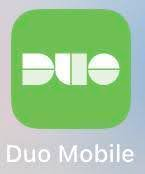

# 常用apps

### canvas

Canvas是教授们发布课程内容的地方。学生们每天都需要用到。特别是疫情时期，教授会在上面发布课程大纲，练习，作业，笔记，课程录播，通知，zoom链接等重要信息。许多作业也是提交到Canvas上。有时候教授也会让同学们通过Canvas联系他们。同学们可以在平板或手机上下载app，也可以在电脑上使用网页版。需要使用UCSD学校邮箱登录。Canvas里包括日历，to
do list，通知等实用的按钮，可以提醒同学们哪天有什么作业due或者几点有谁的office hour。

### pronto

SD的公共交通季度卡是包括在我们的学费里的。在乘坐公交车或者轻轨的时候，需要扫一下Pronto里的二维码，就可以免费乘坐了。首次下载后，使用以@ucsd.edu的学校邮箱创建一个账号，然后选择create
a virtual card。有了virtual card之后，选择Manage按钮，划到最底下，选择Studend and Employee Programs，再选择UCSD
U-Pass。成功后会显示Link Successful。下一步，点击Manage按钮，选择Add Passes。在下一个页面选择MTS，然后免费的季度卡就会显示。选择Buy
Now，不过价格会是$0.00。购买成功后，在Use按钮里会显示Fares Available。每个quarter会自动更新季度卡。夏季没有季度卡。需要的同学需要自行购买，每个季度$60左右。
以下是更详细的视频介绍 https://www.youtube.com/watch?v=JetPN-AXTJI

### Triton2go

学校食堂点餐的app，十分方便。在线上点完单后，会显示大概的等待时间。餐做好后会有通知提醒，然后再去拿，节省了排队等待的时间。

### uc san diego

这是学校的app，上面有学校的核酸鼻拭子自测盒scanner，COVID-19 info，Final时间，Classes，Student
ID，学校各个建筑的arability，食堂开放时间和与你当前所在地的距离，学校的活动，等等等等。但是最常用的还是核酸鼻拭子自测盒scanner。学校要求或自己想自测核酸是，需要在拿到自测盒后先扫描再投入收集的箱子里。

### yelp

类似于美国版大众点评，里面有对各个餐厅的评分以及评价，也可以通过这个app找到餐厅电话进行预约。

### spin

学校常见的电动滑板车，也有电动自行车，需要下载spin app注册扫码使用。只能在校园内骑行，出了校园范围需要上传driver‘s license。

### duo mobile

登录学校网站使用的验证身份app。使用学校邮箱登录的时候一般都需要双重验证。双重验证时，这个app会弹出一条通知。需要及时点击approve，然后就可以成功登录。首次使用需要到学校的https:
//blink.ucsd.edu/technology/security/services/two-step-login/index.html 网站上将新的设备加入到duo mobile里。

### TransLoc

学校的shuttle的map和实时位置都会在这个app上更新，十分的方便。打开后选择triton transit UCSD就可以看到我们学校的shuttle了。
