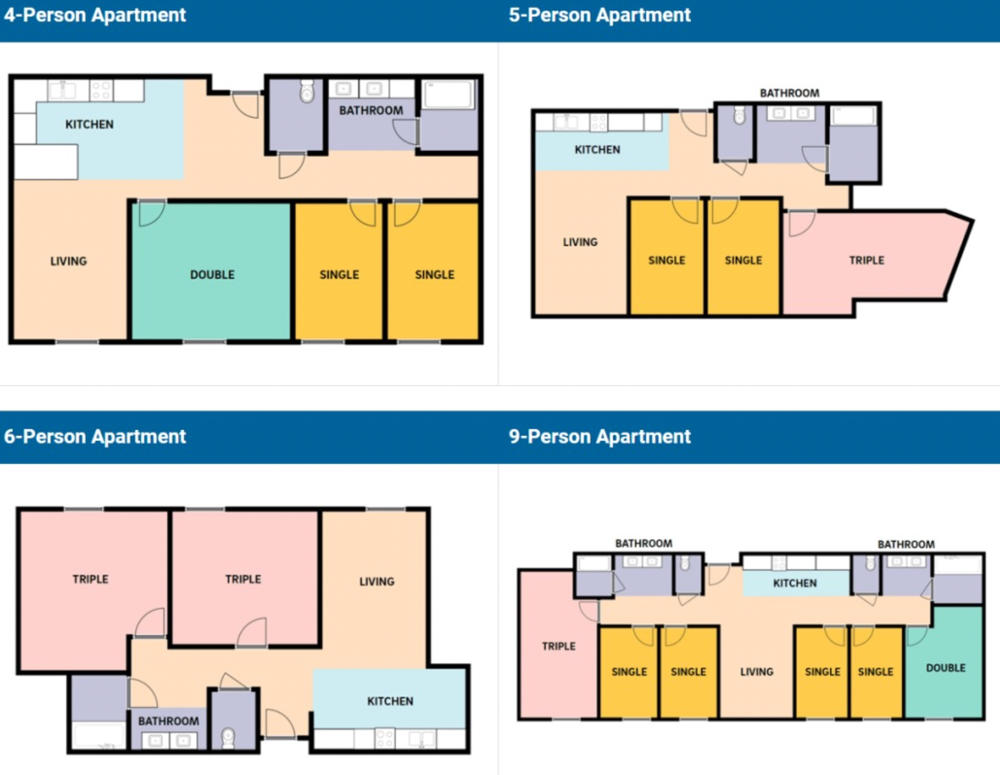

# Eighth college
Eighth College正式提案于2020年是是加州大学圣地亚哥分校的学院中最新的一所。2023年的秋季，Eighth
College迎来第一批学生。Eighth的主题是“参与和社会”（“Engagement & Community”）。Eighth
的参与和社区理念囊括世界上一些最具挑战性的核心问题，包括结构性种族主义、经济差距、健康和福祉、气候危机等等。第八旨在培养学生理解和应对这些挑战的能力，激励和装备未来的领导者。为此，学院希望能帮助学生凭借他们在主要研究领域的专业知识，掌握应对这些挑战所需的技能。

## 地理位置及出行
第八学院的宿舍区位于校区的西南角，将有5栋新楼，最高高度达到21层，为八学院的学生提供2000个床铺以及教学餐饮娱乐超市等设施。毗邻
Revelle且邻近世界著名的La Jolla Playhouse，喜欢看戏剧的Tritons有福了。同时，新宿舍楼坐享La Jolla Shore海岸线欣赏无敌太平洋海景。

## 通识教育（GE)

除开三节阅读与写作课（低阶）和一节实践课外（高阶），八院要求学生在5个领域里面都各选两门课作为GE来上。但是大部分课程是可以由AP/IB换分的并且可以P/NP成绩，而且可以和专业课重合。Eighth
College 的 GE 主要分为以下几个部分：

**Engagement Program：**

在达成入门写作ELWR的条件之后，学生将开始学习学院写作。第八学院的学院写作共有三节，对比ERC和Revelle学院的5节写作课相对轻松很多。三节学院写作里都是lower
division，一节是upper division project-based course，分别是：

- Engagement 1：

这节课通过使用多种学科的角度来增强学生对社会社区的融入，课程阅读材料将集中在社会正义和反种族主义的主题。

- Engagement 2：

跨学科写作课包括工科，人文，艺术，社科和系统理论的视觉来解决社会正义和反种族主义的主题。

- Engagement 3：

课程为学生在Upper Level课程做准备，课程主题包括自我认知，同情心及社会工作等。

- Engagement 120：

这是一个project-based的课程，它将采用在1，2里开发的技能并且用综合，跨学科的方式来解决复杂的问题。

## 其他通识教育
**Arts：**

需要完成两节与艺术相关的课程，其中包括Music, Theatre & Dance, Visual Arts

**Humanities：**

要完成两节与人文，历史相关的课程。其中包括History, Linguistics, Literature, Philosophy, Visual Arts

**Natural Sciences and Engineering：**

需要完成两节跟自然科学和工程有关的课程。其中包括Biological Sciences, Chemistry and Biochemistry等等，推荐CHEM
4，6A，11以及SIO系列，都是比较认真听课好好完成作业就能取得不错的成绩的。

**Quantitative Reasoning：**

需要完成两节与数学，逻辑，统计相关的课程。MATH 10系列，MAE 5，PSYC 60，都是比较推荐的课程。大家可以去官网查询详细的课程列表并且和自己的专业课对照看看有没有可以重合的部分。

**Social Sciences：**

需要完成两节与社会科学相关的课程。其中包括Anthropology, Cognitive Studies, Communication, Economics…

## 学院宿舍
第八学院的宿舍还没有完全建造完毕，从官方的信息来看第八学院将会提供4种Apartment来供学生生活。包括4人，5人，6人，9人公寓。学生可以选择单人，双人以及三人间。

因施工延误问题部分新生会被放置在Sixth College的North Torrey Pines Living and Learning
Neighborhood。八院因施工延误的Housing预计会在Winter 开放。

> **致谢**
> 搬运｜陈佳钰