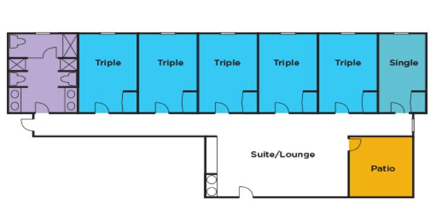
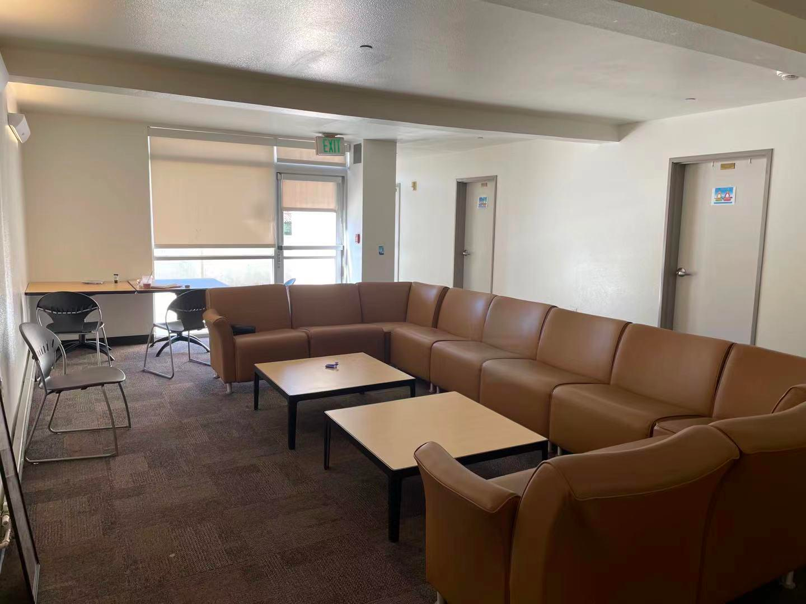
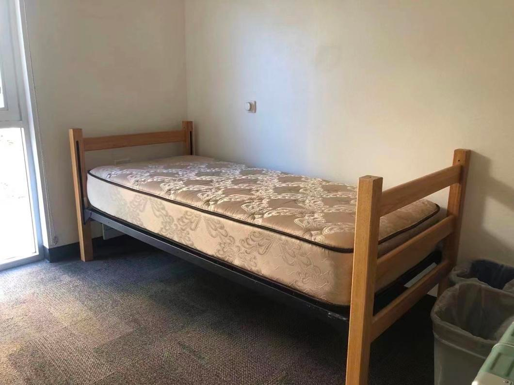
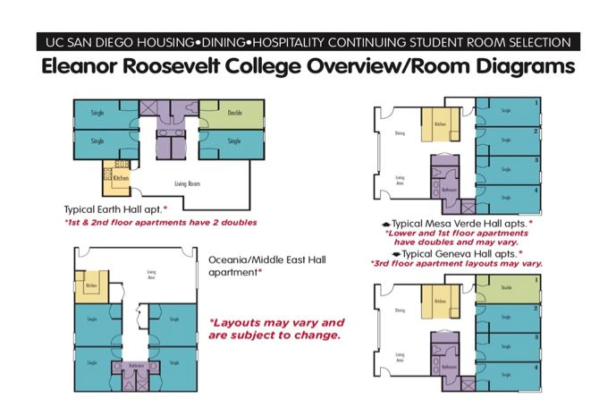

# Eleanor Roosevelt College

Eleanor Roosevelt College（简称 ERC）成立于1988年，最开始只是被称作“The Fifth College”，直到 1994 年才被重新命名为现在的“Eleanor Roosevelt College”。

ERC是以美国第三十二任总统夫人Eleanor Roosevelt命名的。Eleanor Roosevelt是一个富有激情，聪慧，独立的女性，并且她一生都在为国内外的公共服务作出贡献。ERC的理念，“Developing world citizens through scholarship, leadership, and service”，也与其高度重合，鼓励同学们利用自己的学识，领导力，和为他人服务的能力，成为一个世界公民，为世界的发展贡献出自己的力量。

## 地理位置及出行
ERC 位于学校的西北部，位置相对较偏。从宿舍走到图书馆大概要15分钟左右。不过，ERC 距离 Rady School of Management，全校最大的健身房 RIMAC，和超市 The Village Market 都很近，走路都在五分钟左右。同时，顺着Village旁边的楼梯走下去，十分钟左右能到一个叫Black Beach的海崖，有时可以看到非常漂亮的日落。

尽管位置有些偏，但是 ERC 周边的公共交通系统还是比较发达的。在 Earth Hall 的对面就是校内 shuttle 的车站，可以在那乘坐 North Campus Shuttle 一直坐到 Price Center 和 Warren College，也可以乘坐 West Campus Connector 从 ERC 坐到 Mandeville Auditorium。如果想乘坐校外巴士的话，从 Africa Hall 旁边的小路下去旁边就是校外公交车站，可以乘坐 101 到 UTC。

## General Education （通识教育）
ERC 的 GE 分为以下七个部分：

**Making of the Modern World**

ERC 的写作课 Making of the Modern World（简称MMW），跟 Revelle College 并称六个学院里最难最复杂的写作课。MMW 一共有五节，分别是 MMW11（人类起源与人类的进化），MMW12（罗马帝国，基督教，佛教，中国，中东与伊斯兰教），MMW13（中世纪至早期近代史），MMW14（工业革命与帝国主义），与MMW15（二十世纪至现在：一战，二战，冷战，与现代社会）。通过五节课的学习，大家会对世界上的历史、经济、文化有一定的了解。如果觉得课业压力较大，推荐在夏校（summer session）时报名MMW。

**Quantitative and Formal Skills**

需要完成两节数理逻辑类的课，包括数学，编程，逻辑学，统计等，一般考了 AP / IB / A-level 的同学换了学分以后都可以自动 waive 掉这项 GE 要求。同时这项 GE 也可以和专业课有 overlap，大家可以查看官网的 GE 可上科目和自己的 Major Requirements 调整选课。同时，最好经常检查自己在My Trition Link上的Degree Audit, 确保自己的课程满足了GE要求或避免自己多上了不必要的GE 课程。

**Natural Science**

需要完成两节自然科学类课程，推荐 CHEM 4，CHEM11，BILD10，BILD22，COGS11，SIO15，SIO35，SIO45等，算是 Lower Division 的自然科学类课程，可以PNP或者是letter grade。如果上课好好听讲并认真完成作业，都能取得不错的成绩。

**Language**

该 GE 要求学生掌握至少一门外语的基本会话和阅读能力。对于留学生来说，如果高中是在国内读的，可以自动满足这项requirement；美高的同学则可通过 SAT2，AP 等考试证明自己的汉语语言水平。如果没有SAT2或者AP成绩，也可以通过学校的语言测试来waive掉language课程的要求。

**Fine Arts**

需要上一节跟艺术有关的 4 个学分的课程，可以 Letter Grade 或者 P/NP。可供选择的类别有 Music, Theatre and Dance, 或者 Visual Arts，但是注意这个要求不能与下述 Regional Specialization 的课 overlap。

**Regional Specialization**

需要要上三节 4 个学分的课程，而且这三节课必须是来自同一个地区。可供选择的地区有 Africa，The Americas and Multi-Ethnic United States，Asia-Pacific，Eurasia，Europe，和 Middle East。注意这三节课只有一节能选择P/NP，同时必须至少两节是 Upper Division（编号100-199）的课程（当然也可以选择三节都上 Upper Division 的课程）。Regional Specialization 推荐LTEA 120系列的课程。

**Upper - Division Writing Requirement**

需要大家至少从 Upper Division 的课程里（100-199）选择一门英文写作课来满足这个要求。如果选择不上 Upper Division 的写作课的话，学院还支持提交 portfolio 以来满足需求，具体要求可看官网。

不管是选择上课还是写 essay，成绩都必须要在C-以上或者 pass 才能满足这个要求，不过 Upper-Division Writing 的要求可以与 Reginal Specialization 的课有overlap。

## 学院宿舍
对于每个住校的学生，学校都会配备一张标准尺寸床和床垫，衣柜，写字桌，垃圾桶。有电源口但是位置比较隐蔽而且数量较少，推荐大家开学前准备好插线板，衣架，烧水壶等日用品。

ERC 的宿舍区主要分成 Residential Hall（简称 ResHall）和Apartments（简称 apt），而 apt 又分成 Earth Hall 等普通 apt 房型和 The Village。

对于住在 ResHall 的学生来说，寒假的时候（十二中旬到一月初）行李可以放在宿舍，但是人需要离开。。春假的时候（三月中下旬的一周），人和行李都可以留在宿舍，但是这个时间段大部分食堂不开放。暑假的时候（六月中旬到九月中下旬），学生和行李都必须搬离宿舍。而对于住在 apt 的学生来说，寒假和春假都可以住在宿舍里，但暑假同样需要离开。

2023年ERC提供学生的选择包括单人间，双人间（Mini Double）详细房间信息请参考ERC年度Housing网站的更新。

下面我们将逐一介绍这几种宿舍的区别。

**Residential Halls**

ERC 的新生一般第一年都会住在五个分别以地区命名的 ResHall 中。每个 hall 有四层楼，每层楼有两个套间，每个套间包含五个 triple（三人间）和一个 single（单人间）。在每一栋 ResHall 的一楼都设有一个公共休息室和一个厨房，配有餐厅桌椅，大沙发，和烤箱、炉灶、微波炉等简单的厨房设施。在工作日时间，公共区域每天都会有清洁人员打扫，但是周末不会。image25.png

ERC - ResHall Layout

疫情前，一般大家都会被分配到三人间，偶尔也会有欧皇被分到单人间。个人感觉三人间的空间还是足够的，就是睡上铺的话可能坐直的时候头会碰到天花板。（2022年秋季前的疫情期间没有三人间。2022秋季开始似乎又会有三人间了）

一个盥洗室里有四个水槽、三个厕所、三个浴室。大家作息时间不同，几乎不会碰到上洗手间或者洗澡需要排队的情况。另一方面，虽然宿舍没有空调只有暖气，但其实已经足够了，因为 SD 晚上一般都很凉快。

Residence hall的每个suite的common room

Res hall内的单人床

**Apartments**

除了 ResHall，也有些学生第一年运气比较好能申到优先给大二学生的 apt。以下以大一新生最常申请到的 Earth Hall Apartments 举例说明。

ERC - Apartments Layout

Earth Hall 隔着ERC 的大草坪在 Res Hall 的对面。和 ResHall 一样，一层会有两个套间，由楼梯分割。一个套间中一般为四个房间，主要由 single（单人间）和 double（双人间）组成。房间大小算是学院中比较宽敞的，特别是单人间；双人间虽然有时为较大的单人间改造而成，但实际居住体验相对也比较舒适。少量公寓房型可能会有三人间。

公寓的公用空间相对较大，一些一层以上的公寓会设有露天阳台。客厅内家具齐全，同时也配有壁橱，经过协商后可以分享这个区域放置自己的行李等。洗漱方面一般配有两个洗手池以及一套卫生淋浴设备。

## 学院生活
**洗衣房**

ResHall的洗衣房位于 Student Activity Center 旁边，与 ERC 的食堂隔着一整个 ERC Green 遥遥相望。Apt 的洗衣房位于每个 apt 的一楼。洗衣服是 $1.25 一次，烘干是 $1 一次，直接从 Triton Cash 里扣钱，建议第一次可以直接充 $50 左右，后面不够也可以再充。

**快递 / 邮件收取**        

ResHall的快递收取点位于 Student Activity Center，在洗衣房旁边，同时有一个 Amazon Locker 位于洗衣房的另一边。去拿包裹的时候要带着 id 卡然后报自己 box number 就可以了。Apartment的快递收取点位于 Residential Service Office，在 Village Market 的对面。

**活动室 / 自习室**

ResHall 的活动室位于 Middle-Earth Lounge，处于ERC Green 的中心地带，里面有钢琴，沙发，有时候晚上会看到有人在排练，平时也是一个可以学习的地方。同时，在 Student Activity Center 也可以打桌球。

Apartment 的活动室位于 The North Break 的左侧，跟自习室是分开的。里面有乒乓球台，桌上足球，还有几个游戏机等。

North Break 的右侧部分是一个比较大的自习室，有桌椅沙发等，配有四台电脑，三个小型自习房间，和一台打印机，平时非常安静。不过需要注意的是，North Break 的门只能由住 Village 的学生刷卡打开。

## 食堂及超市
**Cafe Ventanas**

ERC 的食堂叫 CAFE VENTANAS（简称CafeV），和 STUDENT ACTIVITY CENTER 隔着长长的 ERC GREEN 相望。营业时间为周一到周四 7am - 9pm，周五 7am - 8pm，周末 10am - 8pm。

CafeV 除了每天都会提供的披萨、汉堡、汤及蔬菜色拉等，还会更新一些不同的主食。推荐 POKE BOWL，GYUDON BOWL，STIR FRY，RAMEN BOWL，和 MAC DADDY BOWL，都是小编和朋友们吃了快一年的食物，味道真的很不错。

**Market at seventh college**

ERC 的同学可以去七院的超市，位于 七院食堂BISTRO 的旁边。Market at Seventh College 包含食物、水果、学习及生活用品等，非常全面。同时前台可以做咖啡、茶和奶昔等，也有免费的微波炉供大家使用。营业时间是周中早上七点至晚上十一点，周末早上九点至晚上十一点。

## 附近设施
**Social Science Building**

ERC 附近有一栋 Social Science Building，基本囊括了所有 Social Science Departments，教授和 TA 的 office hour 和一些小型的 discussion 课也会在这里，社科类专业的同学会比较方便。同时，SSB 对面有一个 Robinson Auditorium，平时也会上一些 lecture。

**Academic Advising Office**

位于 ERC Administration Building 的三楼，从 CafeV 往rimac走的天桥上左边，会有一个牌子写着 Academic Advising Office。可以通过 Walk-In （一般为 15 分钟的时间）或者 appointment （提前预约，一般为 30 分钟的时间）的方式与 advisor 交流。帮助的具体方面包括：探索或者更换专业，GE要求的具体细节，讨论一个四年的课程规划，添加第二个专业，添加一个 minor 等等。

**Rady School of Management**

一个比较新的建筑，设施都比较新，景观也很好，可以看到海。一些跟 management，accounting 有关的课程都会在这里上，偶尔也会举办一些讲座和活动。离 Village 和 ResHall 都很近，步行不到五分钟。

**Rimac Arena**

全校最大的健身房，位于学校西北部，离ERC最近，步行不到十分钟。Rimac 有全校最大的举重室，最新的有氧设备，同时大家可以在rimac打篮球和排球等。另一方面，Rimac 也提供相关的健身课程和教练，具体可以在官网上查询。

{: .contribution}
> **致谢**
> 
> 文｜王小美 
> 
> 编｜Victoria Z. 
> 
> 修改｜温馨雨，卜屹汀 
> 
> 排版｜康宁馨 
> 
> 特别感谢 | 杜晓雷 
> 
> 图片来源｜留学在UCSD
> 
> 搬运｜陈佳钰