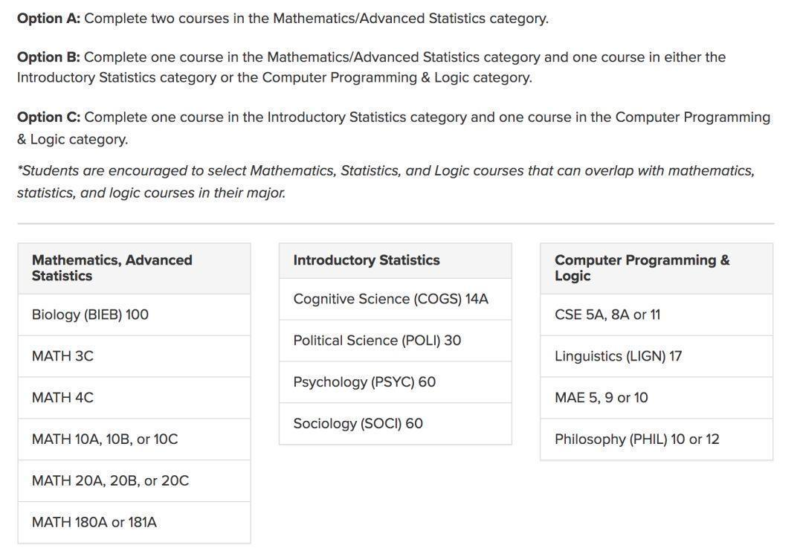

# Marshall College

Thurgood Marshall College， 缩写为TMC，是在 Revelle College 和 Muir College 之后，USCD 建立的第三所学院，曾经也被称为 “The
Third College”。这所学院建成于 1970 年，并在 1993 年以美国历史上第一位非裔最高法院法官的名字 Thurgood Marshall
命名。学院的宗旨和口号是“Developing the Scholar and the Citizen”， 并在学院的徽章上也有出现。Marshall College
强调学生的学识，社会责任心，以及对个人在社会中地位的理解，并主要注重于多元文化，学生专业多为文科，以及经济学教育。

## 地理位置及出行

学院坐落于整个学校的西北方向，基本偏向整个UCSD 的中心地带，可以说相比其它学院是拥有相对优越的地理位置。从宿舍步行到Geisel
Library，Rimac 健身房，和网球场地只需要 10 分钟左右，并且附近的 Pangea 和 Hopkins
两个停车场也能提供便利的停车服务。如果想要滑滑板，骑自行车，或者滑板车，Marshall College 可以说是四通八达，不存在任何障碍物的阻碍。
General Education （通识教育）
Marshall College 的 General Education, 是亲身体验+公认的难度适中以及数量适中，既能学到东西也不会感到厌烦，被很多其他学院的学生小小的羡慕。主要由以下六个部分组成：

**Dimensions of Culture（DOC）**:

需要完成三节写作课三节，主要中心为美国黑人历史与政治问题。

- DOC 1 - Diversity (4 units) Fall Quarter only

- DOC 2 - Justice (6 units) Winter Quarter only

- DOC 3 - Imagination (6 units) Spring Quarter only

*DOC 要花费大量的时间阅读以及写作，所以建议尽早上完。

**Mathematics, Statistics and Logic**:

需要完成两节与数学/统计/逻辑相关的课。如果通过 AP 考试或通过 Math Placement Exam waive掉数学就可以不用上。基础的 lower
课程较为简单，并且可以 P/NP。

**Natural Science**:
要求必须BIOLOGY，CHEMISTRY，以及 PHYSICS 各一节，并且可以选择 P/NP。

**Fine Arts**:
需要完成一节艺术相关的课程，包括美术，电影欣赏，音乐等，并且可以选择 P/NP。

**Humanities and Culture**:
偏向文科的一些课程，基本都需要一些阅读和写作，占用时间或多或少，可以 P/NP。

**Disciplinary Breadth**:
两门 lower division 以及两门 upper division 的课，其中一门 upper division 的课还需要求满足 significant writing
的课程。每年学校会出一个相关的 list 用来参考挑选，且学生必须选择非本专业的，其他专业的课程。

- 社会科学专业（比如 Economics）可以上 humanities / Fine Arts / Natural Science 的课程。

- 自然科学专业（比如Biology）可以上 humanities / Fine Arts / Social Science 的课程。

## 学院宿舍

Marshall College 的宿舍分为 Residential Hall（Res hall）以及 Apartment（Apt）两种。Apartment 又分为 Upper Apt 和 Lower
Apt。目前两种宿舍能被分到的房型都有 Single（单人间），Double（双人间）。2022秋季学期可能会加设Triple（三人间）。
不管是 Lower Apt 还是 Upper Apt，都是独立式小别墅，而且相比其他的学院，Marshall College 拥有更多的 Apt，所以新生拥有更多的机会申请到
Apt。不过大一新生申请到 Lower Apt 的成功几率比较小，偏好的是被分到 Upper Apt。
Lower Apt 距离图书馆要更近一些，Upper Apt 距离学院食堂和健身房要更近一些。除了房型上些许的不同，其他并没有什么本质上的区别。

Marshall College - Upper Apartment’s Layout 

宿舍没有空调，不过会有暖气，冬天不会冻着。厨房会有一个冰箱，四个炉灶，以及一个池子。需要购买餐具，厨具，和做饭的锅。有一个小小的凉台，如果在二楼会更加舒适。在寒假和春假期间，Apt
是可以居住的，但到夏天是要收拾行李到外面租的房子或者等到 Fall 学期的开始并再次入住。为数不多的缺点可以说是隔音效果真的有些差。
相比Apt，Res Hall 主要是少一个小厨房，相对拥挤一些，一般分为四个单人间和两个三人间，所以需要 10 个人共享两个公共卫生间。优点是更加靠近
Marshall 的食堂，Pangea 停车场和快递收取处。

Marshall College - Residential Halls Layout 
Marshall Lower宿舍楼将在2024年度开始进行重新装修及整合界时会提供大约2400床学生宿舍供学生使用扩建项目预计在2025
Fall结束在此期间Marshall将不会提供再提供Lower housing。

Future Marshall Lower Housing Proposal 

Marshall Upper Apartment 内景 

即使Marshall College 的宿舍资源比较充足，但依旧会出现 OVERFLOW 的现象，即宿舍被分到其他学院，比如研究生住的 Village Apt 和
Revelle College 的 Res Hall。宿舍定金以及选择宿舍房型室友并不影响最终的住宿结果，随机出的结果是相对公平的，但还是希望大家尽早提交定金以及所需填写的表格。

## 学院生活

**洗衣房**

Marshall College 的洗衣房是在 Upper Apt 附近，洗衣服是 $1.25 一次，烘干是 $1 一次，直接从 Triton Cash 里扣钱，建议第一次可以直接充
$50 左右，后面不够也可以再充。

**活动室**

Marshall College 的活动室一般是在 Fireside Lounge，靠近 Lower Apt 附近，并且也有洗衣房。
快递 / 邮件 收取
Marshall College 的快递收取处是在Trove（靠近图书馆），信件收取处是在 Fireside Lounge。快递收取时间是从周一到周五的 9:00PM -
3:00PM，信件需要定时检查，银行卡就是在这里收取，并且以后如果要报税的话，税表和医疗保险单可以在 Winter Quarter 收到，也是从这里取。

**食堂及超市**

Marshall College 最主要的食堂就是 Oceanview Terrace（以下简称 OVT），路过 Marshall Field
以及走过一个天桥就到达目的地了。营业时间一般为周一至周日，但有些内部餐馆会有独特的时间安排，节假日一般关闭。从某些方面讲，OVT
是全校风景最好的食堂了。
目前 OVT 主要提供Pizza，烤鸡，三文鱼，沙拉，以及各种饮料甜点。强烈推荐 Acai Bowl。
Marshall College 没有超市，原本超市的位置已经改为活动中心，位置在 Upper Apt 和 Lower Apt 之间。

**附近设施**

- Marshall College 离学校不少主要教学楼都很近，比如 Upper Apt 正对面就是 Economics 的教学楼。另外，几个大的Lecture Hall，例如
Peterson Hall 和 Solis Hall，和一些小的Discussion Rooms，都在Marshall College 步行五分钟左右的路程内。

- Academic Advising Office
Marshall College 的 Academic Advising Office，顺着Upper Apt的路往南走几分钟就会抵达。可以有直接Walk-In 或者 Appointment
两种咨询方式，主要解答关于学院相关的问题。不过专业的问题更偏向于去专业所在的Department Building。

Marshall Field
一片较大的大草地，经常可以看见有同学踢足球，玩飞盘，更多的是举行一些社团聚会和学院性质的活动。有的时候一些社团放的音乐太吵，可能会影响到住在隔音不好的
Upper Apt 的同学。

---
{: .contribution}
> **致谢**
> 文 ｜YX 
> 
> 编｜Victoria Z. 
> 
> 排版｜向都 
> 
> 图片来源｜留学在UCSD 
> 
> 修｜毛芷悦
>
> 搬运｜陈佳钰
