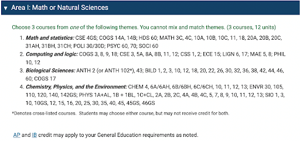
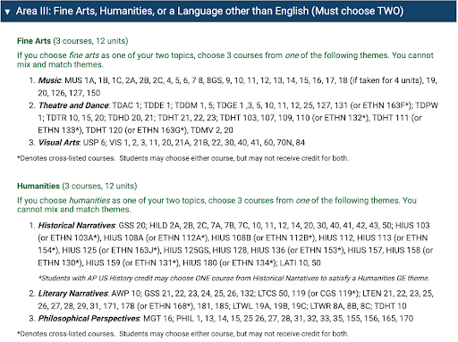
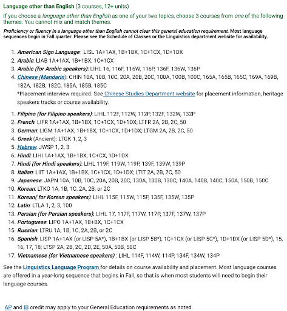
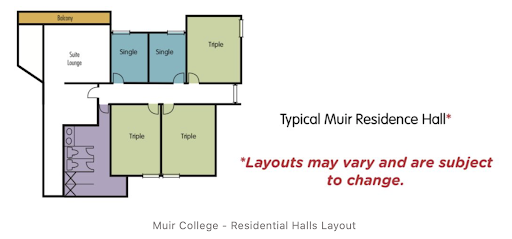
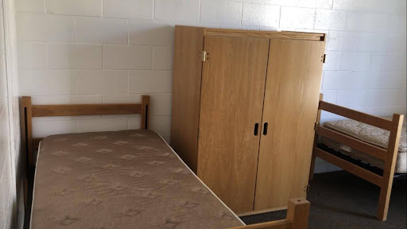
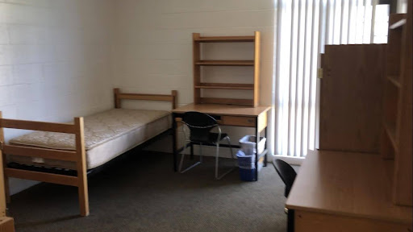
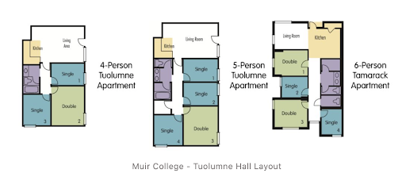

# Muir College介绍

Muir college 创建于 1967 年，是 UCSD 的第二个学院。学院以美国著名环保人士、环保组织 Sierra Club 的创始人 John Muir 先生命名。学院的
motto 是 Celebrating the Independent Spirit，寓意着希望学生们可以拥有多样化的、成功的、坚定的、以及自我指导的人生。作为 UCSD
六个学院中 General Education（通识教育，以下简称 GE）要求最灵活的学院，Muir College 给予了学生最大的自由去选择符合自己兴趣爱好的课程。

## 地理位置及出行

从地理位置上来看，Muir College 离学校的中心不远，从 Muir College 走到 Main Gym（学校其中一个健身房）只需要 5 分钟的路程，同时去
Geisel Library 和上课的地方也比其他学院方便很多。

## General Education （通识教育）

Muir College 要求 GE 和专业课最多只能有三节课 overlap，但是 GE 和 minor 之间 overlap 是没有限制的。同时，GE 可以选择 P/NP。

Muir College 的 GE 分为以下四个部分：

## Ge—Writing Requirements（MCWP）

Muir College 的写作课是小班 seminar式授课。虽然只有两节，但是十分硬核。建议大家前六个学期，也就是大一大二的时候上完，因为大三大四选课的时候，first-pass
不能选 MCWP。写作课必须选择letter grade。

## MCWP 40：

主要是基础的阅读分析写作, 包括分析文章的主旨、论点，进而论证作者是如何发展他的观点的。
 
整个学期一共 3 篇 paper，但是每一篇 paper 都需要交 3 个 drafts 以上。第一篇 paper 是关于指定文章的分析，即写出指定文章的论点、论据等等。第二篇
paper 是两篇指定文章的对比分析，需要写出两篇在论述上的对比。第三篇 paper
是关于指定小说的分析，该小说运用了什么手法和方式，论述和展现了什么主旨。当然小说是在一开学就会给，可以提前开始读。 
MCWP 40 在webreg上写着都是同一位老师的名字，但实际上每几个section会由一位TA上课，也由他负责改作文。不过具体的TA要到了上课才会知道。

## MCWP 50：

主要由 RESEARCH PAPER 组成。通过大量的调查、阅读，然后写出自己的文章。MCWP 50
是按照主题划分，选择什么主题就要进行这一主题的调查与分析。每个学期的具体主题不太一样，但是主要分为humanities，sciences，以及social
and environmental justice三个话题。
 
最终的文章只要求 12 页 （3500-3800字+citations）。前期准备很多：有 3 次 proposal，写出如何构思整个文章。proposal 有具体的要求，要写
5 页（1200-1500字+citations）、改 3 次。Annotated Bibliography是要对 7 个资料进行分析，也会有具体的要求。做完前期准备工作才开始写文章。12
页的正式 paper 需要改 3 个draft。

## GE—Area 1: Math or Natural Science:

需要在以下数学或自然科学类科目中选择同一个系列的三节课完成。

## GE—Area 2: Social Science:

需要在以下社会科学类科目中选择同一个系列的三节课完成。

## Area 3: Fine Arts, Foreign Language, or Humanities

需要从艺术、外语、人文类学科中选择两个方面，并各完成一个系列的三节课。

## 学院宿舍

### Muir College - Residential Halls & Apartments

Muir学院的宿舍包括Residence Hall和Apartment两种。First-year学生一般都会住进residence hall，Second-year学生有机会住进apartment
（在选宿舍的时候只能选择apartment）。Residence Hall有Tenaya和Tioga high-rise residence
halls。Apartment有Tuolumne和Tamarack。Muir学院的同学也有机会住进Sixth College的North Torrey Pines Living Learning
Neighborhood，如果Muir的宿舍住不下了的话。

Residential Hall 的房型有 single（单人间），double （双人间），和 triple（三人间）。每层有 4 个 suite（套间），一个 suite 里面大概
5 - 6 个卧室，共有 2 - 3 个 single 和 3 个 triple，并共享一个洗手间。洗手间内有两个水池，两个卫生间，两间浴室。没有厨房，只有微波炉和水池。每两层是一个
house，会有一个空间蛮大的 Common Area 可以学习，活动，进行 House Meeting。两个 suite 之间也有一个不小的lounge（公共休息区域），可以吃饭聊天学习和使用微波炉。

Muir有两个apartment：Tuolumne和Tamarack。如果幸运的话住高层还可以看到大海。Tuolumne有五层楼。Tamarack位于John’s
Market旁边，看起来比较新，有九层楼。Apartment的房型有 single（单人间）和 double （双人间）。一个 suite 里面大概 3-4 个卧室，共有
2 - 3 个 single 和 1-2 个
double，并共享一个洗手间。洗手间内有两个水池，一到两个卫生间，一间浴室。apartment有厨房和冰箱，其中Tuolumne会有微波炉，Tamarack没有。Tuolumne还拥有阳台。每个apartment都会有一个挺大的客厅，有沙发餐桌等家具。
具体的宿舍介绍及图片可以查看muir官网：
https://muir.ucsd.edu/reslife/roomtours/index.html#:~:text=Singles%2C%20Doubles%2C%20and%20Triples%20available,Housing%20Rates%20and%20Services%20site
与其他学院住宿一样，Muir College 宿舍的空调也只能制热，但其实是足够的，因为即使是夏天的晚上，圣地亚哥也没有热到要开冷空调。一般寒假的时候（十二中旬到一月初），行李可以放在宿舍，但是住在
Residential Hall 的人需要离开（住 apartment 的不用）。2021年因为疫情，Residential
Hall允许继续住。春假的时候（三月中下旬的一周），人和行李都可以留在宿舍，但是这个时间段食堂不开放。暑假的时候（六月中旬到九月中下旬），学生和行李都必须搬离宿舍。

## 学院生活

### 洗衣房

Residential Hall 每两层有一个洗衣房，分别有两台洗衣机和两台烘干机。洗衣服是 $1.25 一次，烘干是 $1 一次，直接从 Triton Cash
里扣钱，建议第一次可以直接充 $50 左右，后面不够也可以再充。

### The Middle of Muir

The Middle of Muir简称M.O.M's。有自习室，室外的桌子，和 M.O.M's Cafe. 自习室Glacier Point每天8am-11pm开放，El
Portal周一至周五8:30am-8:30pm开放。M.O.M’s Cafe 周一到周四 7:30 am-10 pm，周五 7:30 am-7 pm，周六10 am-5 pm开放。 M.O.M’s
Cafe不能用dinning dollar，但能用triton cash。里面也有桌椅，沙发，还有卖一些Muir的小周边，如衣服，徽章等。

### 快递 / 邮件收取

一般包裹放在Trove的Locker里。超大件包裹会放在Trove的counter。Trove位于图书馆门口。Locker每周一至五7:30-23:00，周末9:00-23:
00开门，在这个时间段可以拿着邮箱里收到的二维码去领包裹。Counter周一至五 9:00-15:00 准时上下班，在这个时间段可以拿着 ID
卡去领包裹。Counter也提供寄件服务。
纸质信件会寄到信箱。信箱位于Roots餐厅旁边。每个人都有对应的 Mailbox Number，开学前会收到密码和复古的开箱图示，一般纸质信件都可以在这里拿到。

## 食堂及超市

### Muir College – Pines & Roots

Pines是 Muir College 的食堂,在 UCSD 的众食堂中口碑还不错，每到下课的时间 pines 必爆满。地理位置上也很便利，离 Muir College
的宿舍区和教学楼都很近，位于中心地带，Ledden Auditorium 的后面。营业时间为周一，二，四，五 10:00am - 9:00pm，周三7:00am - 9:
00pm， 周末关门。
Pines 的午餐有很多选择：比如披萨，沙拉，汉堡，三明治，薯条，炸鸡，夏威夷菜和各种炒饭。
Roots也是 Muir College 的餐厅之一，这里只有健康的 vegan 食品。具体位置是从 pines 旁边的楼梯下去，周二到周五 9:00am - 9:
00pm，周末及周一关门。

### Muir College - John's Market

John's Market是 Muir College 的超市，非常非常小，但是一些基本的生活用品和食品都可以买到的。John‘s Market 的地理位置离每一个宿舍楼和
Muir College 的教学楼都很近，基本上步行 1 - 3 分钟都可以到。营业时间为周一到周五 7:00am - 11:00pm,
周末关门。除了咖啡热茶冷饮甜品之外，John's Market 的冰淇淋也不错，每天都有几种不同的口味。

## 附近设施

MUIR COLLEGE 离 UCSD 很多主要的教学楼都很近，比如 Humanities and Social Science Building（HSS），Applied Physics and
Mathematics（APM），Mandeville Auditorium 等。许多大大小小的 lecture 和 discussion 都在这里上，也有很多教授的 office 在这里。

### Academic Advising Office

Muir college 的 Academic Advising Office在 H&SS 的2126。工作时间为周一到周五的 8:00-12:00 和 13:00-16:30，可以通过
appointment，也可以在网上看 Walk-In Advising Hours。同时也可以通过学校的 Virtual Advising Center 线上提问。

### Sun God

Sun God 是 UCSD 最有名的雕塑（也许是因为它真的长相清奇）。它是 Stuart Collection 中的第一个作品，其作者是来自法国的 Niki de
Saint Phalle，于 1983 年建成，并位于 Faculty Club 和 Mandeville auditorium 前的草坪，离 Muir College
很近。雕塑由上面的太阳神和下面爬满藤蔓的石柱构成。关于Sun God，还有一个有意思的传说：考试前倒着穿过Sun God雕塑可以在考试中拿
A。

---

{: .contribution}
> **致谢**
> 文 | 张诗若 
> 
> 更新｜温馨雨 
> 
> 编｜章闻珊 
> 
> 排版｜董纪萱 
> 
> 图片来源｜留学在UCSD
>
> 搬运｜钮臻真，舒欣，舒畅
> 
