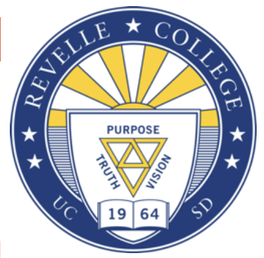
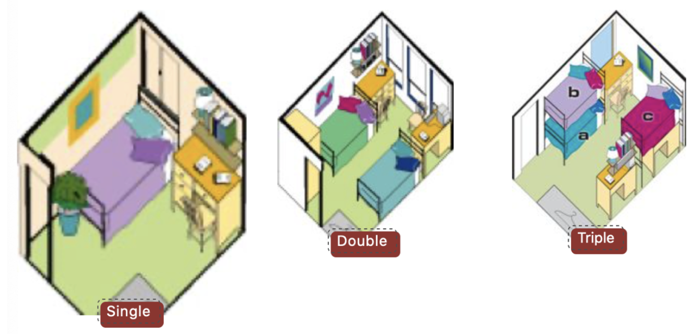
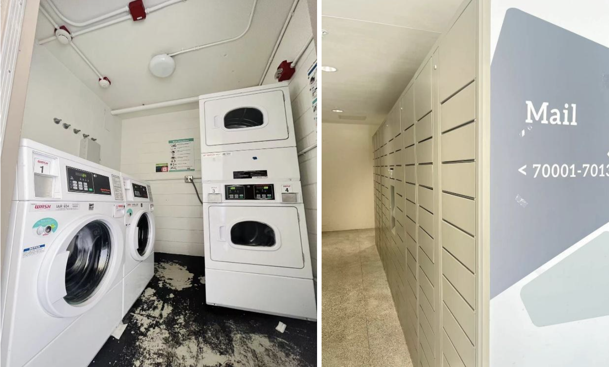

This is college introduction. 
This has multiple pages on various colleges. 

# Revelle college 介绍
Revelle College 是 UCSD 最早成立的学院。它于 1964 年建成，以海洋学家，同时也是 UCSD 的创始人，Roger Revelle 的名字命名。全校的第一个本科图书馆也位于 Revelle College 的Galbraith Hall中。Revelle College 的通识教育（General Education，以下简称 GE）严格按照传统文理学院的标准，致力于培养全面的并为复杂的社会竞争做好准备的学生。

## 地理位置及出行
Revelle College 位于 UCSD 的最南端，虽说位置较为偏僻，但是交通十分便利。在学院的西边和东边都设有圣地亚哥 MTS 系统的公交车站，步行五分钟便可到达。如果想乘坐校内的 shuttle，在学院东侧，西侧以及南侧的教学楼附近也可以找到 shuttle 的车站，线路有校内的Inside Loop 和Outside Loop，会经过 UCSD 所有学院，以及贯通海边和UCSD School of Medicine 的SIO。

## 1.2 General Education （通识教育）
Revelle College 的 GE 分为以下六个部分：

1. Humanities Requirements
    Humanities 是 Revelle College 的写作课，共有五个课程，由历史（History Department）、哲学（Philosophy Department）和文学（Literature Department）一起推出，并不能通过 P/NP 完成。该系列课程主要叙述了西方人文主义的发展，从罗马与基督教讲起，到文艺复兴，启蒙运动和 1848 年以来的现代文化都有一一涉及。作为所有学院GE中最难的写作课，该系列课程阅读量较大并且作业对于不善于写Critical writing的学生难度较高。且因为HUM系列不能选择P/NP，所以在选择学院时建议谨慎考虑。但是非常推荐对于文学，宗教以及哲学感兴趣的同学尝试。比较推荐Kristina Marksman教授。

2. Mathematics Requirements
    需要完成两节微积分课程以及一节选修课，并不能通过 P/NP 完成。微积分课程需从 Math 10 系列或者 Math 20 系列中选择（取决于专业需求，一般社科可以选择 10 系列，理工科商科等需选择 20 系列）。选修课需从下列课程中选一门上：MATH 10C（微积分 III）, Math 20C（科学和工程学的微积分与解析几何），Math 11（基于微积分的概率与统计学入门）, Math 18（线性代数）和 Phil 10（逻辑学导论）。

3. Natural Science Requirements
    共需完成五节课程，基础要求为一节生物，一节化学，一节物理。除了这三节课程之外，还需从生物，化学，物理，或者环境科学课程中选择两门上。因为考虑到专业要求中也会有这些课程，理科专业学生推荐 Letter Grade上专业相关的课，文科专业学生则可以选择 P/NP。
    (推荐Chem 11，Bild3，比较简单有趣，或者选择和专业课重叠的课即可）

4. Social Science Requirements
    需要完成两节社会科学类课程，并不能选择 P/NP。如果是社科专业的学生，Upper Division 的专业课并不能用来抵这一项 GE 要求。

5. Fine Arts
    需要从 Music, Theater and Dance 或者 Visual Arts 等系列的课程中选择一门完成，并可以选择 P/NP。
    【推荐MUS 95K（大合唱）和TDMV系列（舞蹈），这些课除了要求出勤率平时几乎没有作业和考试，期末考试一般是大家一起表演】

6. Language Requirements
    该 GE 要求学生掌握至少一门外语的基本会话和阅读能力。对于留学生来说，如果高中是在国内读的，可以自动满足这项requirement；美高的同学则可通过 SAT2，AP 等考试证明自己的汉语语言水平。

## 1.3 学院宿舍
### Revelle College - Keeling Apartment
Revelle College 宿舍区的 apartment 叫做 Keeling Apartment, 大一新生一般不会住在这里。Keeling Apartment 一共有八个 communities，每个 community 有 6 名学生分在两个 double（双人间）和两个 single （单人间）里，并配有一个 Residential Assistant（RA）。

### Revelle College - The Fleet
The Fleet 是另一片 Revelle College 的宿舍区，但一般会分给其他学院宿舍区住不下的学生。Revelle College 的新生一般不会入住这片宿舍区，所以在此不细讲了。

### Revelle College - Argo Hall
Argo Hall 共有六层，每一层有六个 suite （套间），并有一个大 lounge（公共休息区域），放有烤箱、微波炉、桌椅沙发等。其中，每两个 suite 共用一个厕所，每个 suite 大概有 12 到 16 名学生，并配有一个相较于 lounge 来说较小的 Common Area。相对于 Argo Hall 相对来说较多的容纳人数，Blake Hall 稍微规模小一些，只有四层，其他方面与 Argo Hall一样。

大部分 Revelle College 大一新生会被分配到 Residential Hall 的三人间。三人间有些是之前的双人间改造成的，所以如果放地上的东西一多，就会让房间内显得比较拥挤。但是共享的洗漱池，浴室，厕所这些，即使是 16 个人一起使用，但是实际体验并不会觉得设施不够用。
另一方面，虽然宿舍的空调只能制热，但其实已经足够了，因为圣地亚哥晚上有时候还是挺冷的。总的来说，Residential Hall 的居住体验还是不错的，有机会能认识更多的同学。
一般寒假的时候（十二中旬到一月初），行李可以放在宿舍，但是人需要离开。春假的时候（三月中下旬的一周），人和行李都可以留在宿舍，但是这个时间段食堂不开放。暑假的时候（六月中旬到九月中下旬），学生和行李都必须搬离宿舍。  

## 1.4 学院生活
### 洗衣房
Residential Hall 的每一层都会有一间洗衣房，配有两台洗衣机以及两台烘干机。洗衣服是 $1.25 一次，烘干是 $1 一次，直接从 Triton Cash 里扣钱，建议第一次可以直接充 $50 左右，后面不够也可以再充。

### 快递 / 邮件收取
取快递在 Argo Hall 一层的一个叫 Parcel Center 的Room 118里，带上 ID 卡并报上自己的 Box Number 即可。取邮件在这个 Parcel Center 对面，在屏幕上输入相应密码即可打开你的格子。有时从 Amazon 邮寄的商品也会寄到 Amazon Locker，具体地点在 Roger's Market 的南边。

### 活动室
Commuter Lounge 位于 Blake Hall 的一层，是一个供大家学习和休息的地方，配有桌椅沙发、电脑和微波炉等。同处于 Blake Hall 一层的 College Center 是另一个供学生学习和休息的大区域，配有桌椅沙发、电脑和打印机。

## 1.5 食堂及超市

**Revelle College - 64 Degrees**

Revelle College 有两个食堂，64 Degrees 以及 64 Degrees North。所有住校的学生都需要充值DINNING DOLLARS，用于在学校食堂和学校超市的花销。

64 Degrees 位于 Argo Hall 的西边 50 米，工作日开放时间 07:00am - 9:00pm，双休日开放时间是 10:00am-08:00pm。

这里最常开放四个窗口。第一个窗口Wok 提供中式米饭和炒菜，并配有蔬菜沙拉，炒菜（牛肉、鸡肉、豆腐、青菜）, 春卷等。第二个窗口 64
Triton Grill 提供64 Degree的招牌汉堡，三明治，薯条和鸡块等。第三个窗口Taqueria 提供墨西哥的食物，比如Burrito 、
taco、quesadilla 等。第四个窗口64 Revelle Cuisine 提供比较西式的食物，并且会根据holidays/special days更改菜单。

64 Degrees North 与 64 Degrees 相通，仅工作日开放，营业时间是 11:00am-03:00pm。这是一个非常正式的西餐厅，菜品相对 64 Degrees
会更昂贵些，但是依然可以使用 Dining Dollars。餐厅会提供甜品以及正餐，包括布丁，巧克力蛋糕，烤三文鱼，烤蘑菇意大利烩饭等。(
自疫情以来，64 Degrees North暂不开放)

**Revelle College - Roger's Market**

Revelle 的超市叫做 Roger’s market，开放时间为07:00am-11:00pm。Roger’s market 取自学院命名者 Roger Revelle 的名字，位于 64
Degrees 的西边，与食堂相通。这里会卖一些常用的食品和生活用品，包括速食产品，面包，零食，饮料，方便面等。平时的生活用品包括洗发露，沐浴液，护发素，水杯，洗衣液等；药品包括感冒类药物，酒精，耳塞等等。

## 附近设施

**Academic Advising Office**

Revelle College 的 Academic Advising Office 位于 GALBRAITH HALL 的后方，工作时间为 08:00AM-12:00PM，01:00PM-4:30PM，可以通过
WALK-IN 或者 APPOINTMENT 的方式与 advisor 交流。帮助的具体方面包括：探索或者更换专业，GE要求的具体细节，讨论一个四年的课程规划，添加double
major或 minor 等等。

**Revelle Plaza**

Revelle College 最具特色的建筑当属 Revelle Plaza，位于 Galbraith Hall 的北边，Argo Hall 的东边，是一片非常大的广场。广场上建有喷泉，国旗，四周环绕着
York Hall, Galbraith Hall 和 Argo Hall 等主要教学楼及宿舍楼。这片广场上经常会举行活动，例如音乐会，或者蹦床类的游乐设施。疫情期间Revelle
Plaza 会有为室外授课搭建的小帐篷。

{: .contribution}
> **致谢**
> 文 | 张启文 
> 
> 修改｜Lindsey 
> 
> 编｜章闻珊 
> 
> 排版｜董纪萱 
> 
> 图片来源｜Lindsey，留学在UCSD
>
> 搬运｜陈佳钰，钮臻真，舒欣，舒畅
