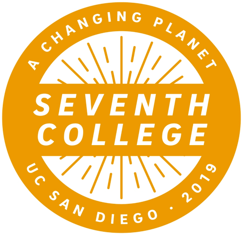
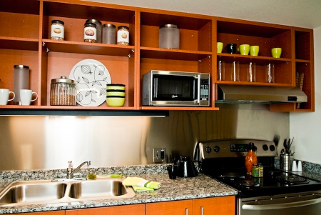
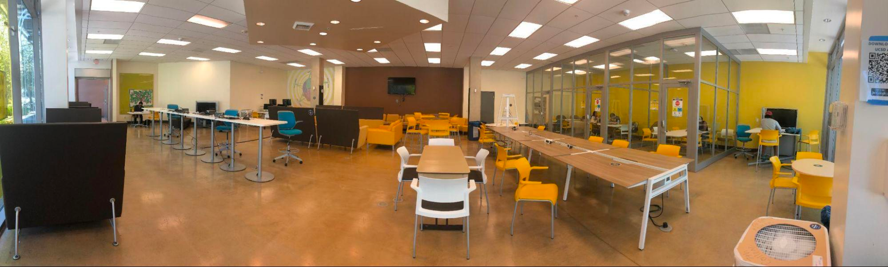
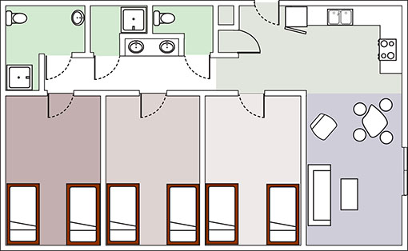
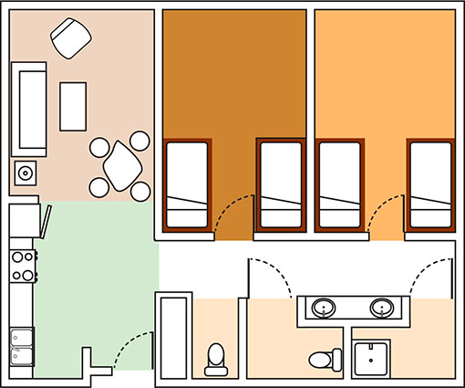
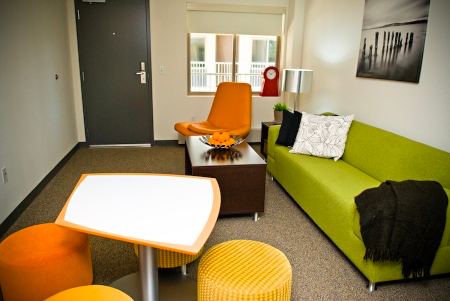
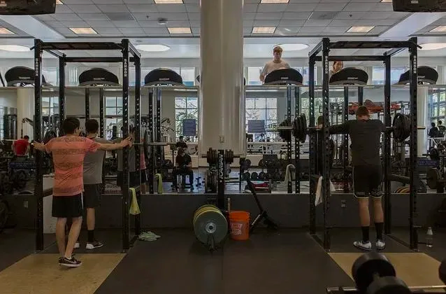

# Seventh College
第七学院正式成立于2019年5月15日。2020年的秋季，第七学院迎来了第一批学生。学院方面预计到2027-2028年，第七学院将稳定接受4000名左右的学生。

第七学院的主题是“不断变化的星球”（“A Changing Planet”）。这包括人类所面临的一系列紧迫的全球性问题，例如气候危机，大规模移民以及文化和技术的变革。第七学院鼓励学生从跨学科的角度解决大规模的全球性问题。为此，学院希望能帮助学生凭借他们在主要研究领域的专业知识，掌握应对这些挑战所需的技能。

## 地理位置及出行
七院位于学校原来The Village区域，在学校的西北角。临近海边，风景很美。七院的宿舍距离Rady School of Management 非常近。但是去学校的中心Price Center和一些教学楼比较远，交通不太方便，步行比较花时间，赶时间的话可能需要骑自行车或者scooter之类的

## 通识教育（GE）
七院的通识课相比较其他学院的通识课来讲会相对轻松，更平均地分散在学生整个大学四年的课表中。但就目前公布的信息来看，第七学院的通识教育将相当轻松。

**写作**
在达成入门写作ELWR的条件之后，学生将开始学习学院写作。第七学院的学院写作共有三节，对比ERC和Revelle学院的5节写作课相对轻松很多。三节学院写作分别是：

- SYN1： Perspective on a Changing Planet

- SYN2：Explorations of a Changing Planet

- SYN100：Solutions for a Changing Planet

Seventh 的写作的grading方式是grading contract，所有的作业grading based on completion，ta不会给作业进行打分，而是会以complete或者incomplete的形式来标注每个人的作业。开学的时候每个人自行选择A contract， B contract 或者 C contract，每一份contract都有对应需要完成的作业数量和缺课次数，只要这一学期的完成度与你的contact相符合甚至更好，则拿到A等级并不难。 写作主题是围绕气候危机-全球变暖来展开的，挺有意思的。 

第七学院要求学生在以下5个领域中，每一个领域需完成两门课程，合计十门课程，第七学院的选择非常广，每个领域的课程选择都很多样：

**艺术类（Arts）:**

Music, Theater & Dance, Visual Arts

**人文类（Humanities）:**

African American Studies, Chinese, History, Japanese, Jewish Studies, Linguistics, Literature, Philosophy, Visual Arts History

**自然科学与工程类（Natural Sciences and Engineering）:**

Biological Sciences, Chemistry and Biochemistry, Computer science & Engineering, Environmental Studies, Environmental Systems, Physics, Oceanography

**数理逻辑（Quantitative Reasoning）:**

Cognitive Science, Computational Social Science, Computer Science & Engineering, Data Science, Electrical and Computer Engineering, Economics, Human Developmental Sciences, Mathematics, Mechanical and Aerospace Engineering, Political Science, Psychology, Management, Sociology

**社会科学（Social Sciences）:**

Anthropology, Critical Gender Studies, Cognitive Science, Communication, Economics, Education Studies, Ethnics, Public Health, Global Health, Latin American Studies, Psychology, Sociology, Urban Studies and Planning

**实践课程**

第七学院要求学生完成一节实践类课程，但此类课程大部分情况下可以和专业的课程重叠，所以很好完成。除了专业类课程，AIP 197 ，部分197，198，199的课程，以及国际交换项目均可完成此项要求。

## 学院宿舍
第七学院的宿舍区（原 The Village）位于校区的西北角，毗邻ERC，距离大部分教学楼都相对较远，但是与管理专业的教学楼（Rady School of Management）很近。学院附近有全校最大的超市以及最大的足球场和体育馆，吃喝健身一条龙服务，你值得拥有。同时，从宿舍区向西步行大约十分钟就可以到达海边，欣赏无敌太平洋海景。

The Village全部由apartment组成，没有residential hall，在面海的宿舍内即可欣赏海景。但是宿舍多为三人间，申请单人双人的难度略大，所以建议选择住校的七院学生做好提前约舍友的准备。每一个套间由2-3个三人间组成，共享浴室，厨房和小客厅。宿舍的厨房会配备基础设施，包括灶台，烤箱，以及冰箱。通常来说，apartment每周会有专人来打扫一次宿舍的公共区域。

Apartment寒假和春假期间不需要搬离宿舍，但是暑假期间仍需搬离并清空宿舍。房间内的配套设施包含床，床垫，桌椅，桌上书架，衣柜以及垃圾桶。其余生活用品仍需另外购置。

## 学院生活
**公用厨房**

有完整的厨房设施，不包括餐具。

**快递 / 邮件收取**

第七学院的快递收取点在Residential Service Office, 在Village Market对面，SEVENTH WEST BUILDING 2的第二层，请带上ID卡。具体地址在第二层的Parcel Center，开放时间是周一到周五早上九点到下午三点。Amazon的Lockers位置在west Building 2的第一层。

**活动室**

_Game Room：_

- 每天8:00 AM-10:00 PM开放。周一到周五 8:00 AM-6:00 PM可以在residence office借游戏器材。里面有乒乓球台，桌上足球，台球，桌上冰球，太空弹球游戏机，还有几个赛车游戏机等。

_The North Break：_

- 每天8:00 AM-10:00 PM开放。North Break是一个比较大的自习室，有桌椅沙发等。配有四台电脑，三个小型自习房间，平时非常安静。

- 配有桌椅沙发，适合remote learning或者闲暇时间和朋友娱乐。

**Room Layout**

在官网上有每栋建筑每层详细的layout：https://seventh.ucsd.edu/residence-life/living-at-seventh/index.html 

**Laundry**

位于 Seventh West Building 1和3的第一层，以及Seventh East Building 3的第一层。需要携带ID卡，输入进入宿舍的密码使用。 洗衣服是 $1.25 一次，烘干是 $1 一次，直接从 Triton Cash 里扣钱，建议第一次可以直接充 $50 左右，后面不够也可以再充。

## 食堂及超市
**The Bistro**

The Bistro 是一家日式料理食堂，包括寿司、拉面等。虽然是全校最北的食堂，但是味道真的很不错！饭点时都会有非常非常多的订单，所以一定要提前30min到1h点餐哦！开放时间：周二至周五 11：00am-9:00pm

具体菜单测评可以看我们之前出过的推送：

[生活周刊｜Bistro菜单大盘点 （上）](https://mp.weixin.qq.com/s?__biz=MjM5NzkyMzAxMg==&mid=2650394582&idx=1&sn=a6866f731d3d9c397568e3f97bdb1993&scene=21#wechat_redirect)

[生活周刊｜Bistro 菜单大盘点（下）](https://mp.weixin.qq.com/s?__biz=MjM5NzkyMzAxMg==&mid=2650394713&idx=1&sn=13a4b71c0904a552a18d245ddb7311e9&scene=21#wechat_redirect)

Ps. 以上推送内有些菜品目前没有。具体有什么菜品可下载triton 2 go mobile order app查看。这是ucsd学生线上点餐的app。

**The Market at seventh college**

位于Bistro食堂旁边，和其他超市一样，出售零食，水果，蔬菜，蛋糕，面包，生活用品。也可以现场点咖啡等饮品。开放时间：周二至周五 7：00am-11:00pm，周六至周一9：00am-11:00pm

## 附近设施
**academic advising office**
位于The Gallery， Village Market的二楼，office hours是从周一至周五的8:30 am - 4:30 pm。

可以通过 Walk-In （一般为 15 分钟的时间）或者 appointment （提前预约，一般为 30 分钟的时间）的方式与 advisor 交流。帮助的具体方面包括：探索或者更换专业，GE要求的具体细节，讨论一个四年的课程规划，添加第二个专业，添加一个 minor 等等。

Academic Advising Office 同样提供线上服务，只需要通过 Triton Link 的子菜单进入 Visual Advising Center 就可以在线提问，1 - 2 个工作日内一般就能收到回复。

**RIMAC**
全校最大的健身房，位于学校西北部，离ERC最近，步行不到十分钟。Rimac 有全校最大的举重室，最新的有氧设备，同时大家可以在rimac打篮球和排球等。另一方面，Rimac 也提供相关的健身课程和教练，具体可以在官网上查询，https://recreation.ucsd.edu/。

## 地理位置及出行
七院位于学校原来The Village区域，在学校的西北角。临近海边，风景很美。七院的宿舍距离Rady School of Management 非常近。但是去学校的中心Price Center和一些教学楼比较远，交通不太方便，步行比较花时间，赶时间的话可能需要骑自行车或者scooter之类的

> **致谢**
> 搬运｜陈佳钰