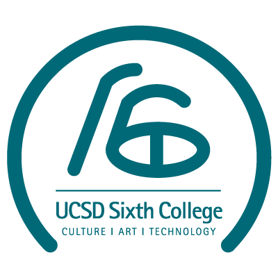
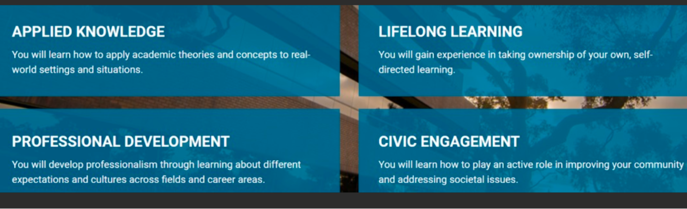
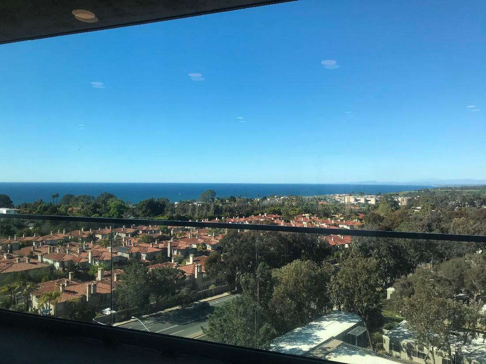
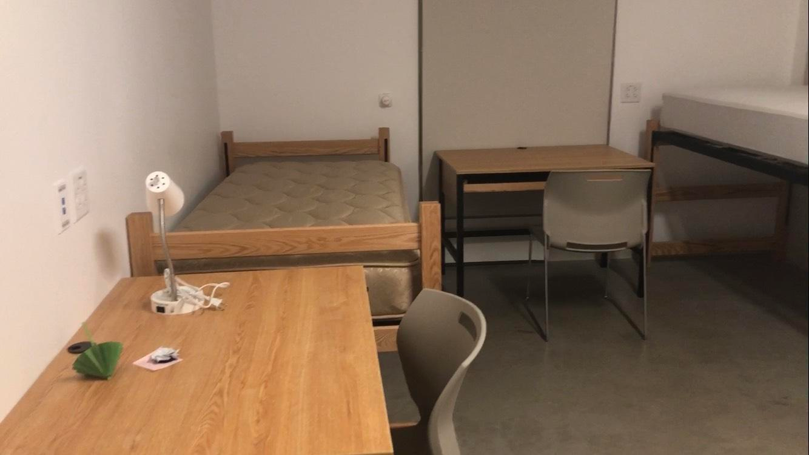
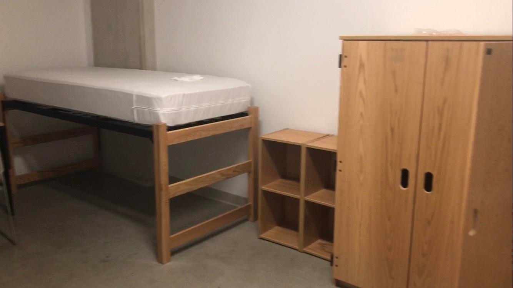
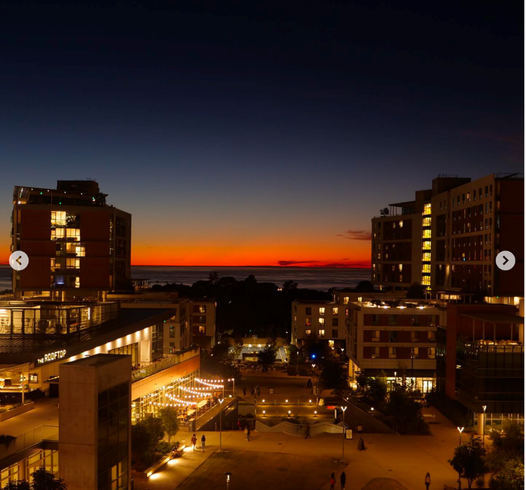

# Sixth college 

Sixth College 最初建立于 2001 年。叫做 Sixth 仅仅是因为它是 UCSD 建立的第六个学院，暂时还没有被冠以金主（划掉）名人的名字（事实上每一个学院在被冠以正式名字之前都会以数字作为暂时的名字）。Sixth College 的主题是 Culture，Art and Technology，旨在培养出具有创新能力和国际视野的人才，简称为 CAT 的学院写作课涉及的也是同样的主题。

## 地理位置及出行
Sixth College 2020年搬到了North Torrey Pines Living & Learning Community, 在Muir和Marshall之间 ，到GEISEL图书馆的步行距离五分钟，是离校园中心最近的宿舍。新六院的学生有一句话描述六院的地理位 置：”到哪儿都近”。Sixth College 宿舍楼里就备有一些大型讲座厅，大部分课程都不需要走很远。小编上学期在校区的东 北端和西南端（Warren和Revelle）都有课，但两者步行距离只有十五分钟，是非常便利的校园住宿区了。

六院的三栋楼的地下一层到三层是新建的停车场，停车位也是比较充足的。距离Sixth College 最近的公交车站步行距离五分钟，位于校园西边大路的两侧。只有一班101会路过 ，从北部的海滨小镇Oceanside到UTC。但从Sixth College走到学校在Gilman Drive上最大的两个公交站步 行距离也不远，15分钟就能到达。六院中心还有一个校园公交站，公交每15分钟到半小时绕校园一圈，可 以搭乘去上课或者去找其他学院的朋友玩～

距离 Sixth College 最近的体育中心是UCSD Triton Arena，如果要去 gym，步行距离在9分钟左右。同时，Sixth College 拥有自己的地下停车场可直接通往教学楼和公寓。

## General Education （通识教育）
Sixth College 的 GE 要求的课程相对比较杂，但不需要深入所以整体难度不高，选择余地也相对较大，学生可以比较自由地安排 GE 课程以缓解专业课的压力或者探索更多自己可能感兴趣的领域。

Sixth College 的 GE 主要分为以下八个部分：

**Culture, Art, and Technology（CAT）**
Sixth College 的写作课，包含三节 LOWER DIVISION（CAT1，CAT2，CAT3）和两节 Upper Division（CAT125，practicum）。因为主题是Culture，Art and Technology（CAT），所以也被亲切地称为“吸猫课”，属于六个学院中得 A 率最高的写作课之一。

虽然所有的写作课都会围绕着这CULTURE，ART AND TECHNOLOGY 展开，但是每个教授都会有自己的小专题，比如音乐、游戏、小说、人文、电影等等，他们的给分方式也不尽相同（比如纯靠 midterm 和 final 的和纯靠 essay 的）所以选好教授相当重要，最好在 cape 或者 RateMyProfessor 上查询教授的评分。

CAT1 和 CAT2 都需要一本名为“THEY SAY I SAY”的书，主要是给大家一些基本句式还有教大家怎么阐述自己和他人观点。CAT1 和 CAT2 都只能 Letter Grade，但 CAT3 可以 P/NP，不过对于以后可能有申请的同学还是建议 Letter Grade。三节课主要培养大家 Academic writing 的能力，具体来说就是 Formal wording, Structure, Citation 等等。Citation 非常重要, 否则被判抄袭后的后果很严重，当然老师和 TA 会详细地教授如何进行引用。

- CAT1（4学分）：Critical Reading and Drafting，会有比较多的阅读材料需要读，一学期会有五六篇 250 字的小 essay 和两篇 4 页左右的大 paper。

- CAT2（6学分）：Academic Writing，Building Arguments 和 Revision。整个学期会在期中和期末各交一篇大 paper，平时的作业基本就是反复修改 paper。

- CAT3（6学分）：Writing and Research，会更多地 focus 在实践上，作业可能是剪一段音频或一段视频。最后的作业是一篇大 paper 和两个 Annotated Bibliography。

- CAT125（4学分）：主要是运用 CAT1/2/3 的知识面向毕业后的工作与生活。CAT125 也有网课版本 CAT125R，同学们可以选择暑假期间在国内上网课。

- Practicum（4学分）：可以从以下的四个Track中选择一个来满足Experimential Learning的学分要求。

**Information Technology Fluency**

共一门课，包括 COMPUTER SCIENCE、COGNITIVE SCIENCE、ELECTRICAL AND COMPUTER ENGINEERING 等领域。可以选择 CS 最基础的课程，例如 CSE 8A 等，不太需要编程基础，但可能需要大量的时间精力，但是了解一点 coding 对未来工作和生活都有一定帮助。

**Social Analysis**

共两门课。注意需要从给出的 list 里选两个不同领域的课程， 例如 Economics 和 Government。这里比较推荐理科生选择 Econ 1/2/3，因为评分主要是根据考试的成绩给出，不需要写 essay。MGT 16 和 MGT 18 作为入门管理学，同样很受中国学生欢迎。此外，MGT 18 同时还可以满足学校 DEI 的课程要求。

**Narrative, Aesthetic and Historical Reasoning**

共两门课。包括 ART HISTORY、HISTORY、LITERATURE、FOREIGN LANGUAGE 等领域。对于语言感兴趣的同学可以选择小语种，虽然 Workload 相对比较大，但是课程大多非常有意思。这里需要注意，中国国籍的同学是不可以选择 Chinese 来满足这项要求的。此外，这里还推荐 TDGE 25 ，主题是 public speaking ，相信这项技能对于大部分人来说都非常实用，课程内容简单而有趣。

**Analytic Methodologies/Scientific Method**

共两门课。可以从同一领域专业课程里选，主流选择是生物，化学和物理。大部分同学都选了一节 Chemistry 6A 和一节 Physics 2A。这两节课对于从国内高中来 的同学们来说就是复习旧知识，唯一的难点可能是专业术语。对于美高的同学来说也不会很难，12年级的 Chemistry 和 Physics 也基本都讲过，稍微延伸一下。两节课都不需要 P/NP，Letter 基本没有压力。

**Structured Reasoning**

共一门课。一般来说都上数学 Lower Division Sequence 如 Math 10A/B，20A/B 即可。10 系列课程相对简单，专业没有数学要求可以考虑，对于需要大部分理科和商科来说，20 系列的数学课可以给未来的数学奠定更好的基础。

**Exploring Data**

共一门课，很多理科专业的同学可以直接拿专业课抵掉。其他专业的同学也可以选和自己专业课 Overlap 的课程，比如 Econ Major 可以选 Econ 120A、数学统计类的可以选 Math 11、社会科学 Major 的可以选 Psychology 60 等来完成。

**Art Making**

共计需要八个学分。最推荐的课是 MUS 95G，福音大合唱，学生可以反复上这节课直到满足8个学分，如果准备这样做的话，可以找三个学期，上一次两个学分的 MUS 95G 和两次三个学分的 MUS 95G，两者的区别在于要求参与的 Performance 数量不同，但是平时上课的内容完全相同。

VIS 系列的课大多很有趣，适合本身有美术功底的人选择，但是 WORKLOAD 相对比较大，每周都需要额外花 4-5 个小时。MUS 1 系列以乐理为主，有乐理基础可以选择这几门课。TDMV 1/2/3 是舞蹈课，需要小组排舞，以及写一篇短 essay，也是相对有趣的课程。

## 学院宿舍

对于住校生，宿舍的标准配置是每个人一张 Twin Size 的床及床垫，衣柜，书桌以及桌上书架，椅子，以及垃圾桶。大部分生活用品则需要自己准备，详情可以参考本公众号将在暑假期间推出的行前准备篇。

Sixth College 在North Torrey Pines Living Learning Neighborhood的新宿舍于2020年建造完成。一共有四个residential buildings，分别是 Catalyst，Kaleidoscope，Tapestry，以及Mosaic。宿舍的类型分为分为suite 和 Apartment（简称 Apt）。

**Sixth College – Residence Halls**

一般第一年进来的新生会住在residence halls。Residence hall一般有8到12个同学一起住，取决于被分到的层。房间以单床房（single）和双床房（double）为主。每个床配备一个书桌，一个衣柜。Residence hall的洗手台和浴室是分离的，并且浴室是独间的，洗澡都有独立的空间。小编（Jessica）的宿舍有12个女生，五个double，两个single，三个卫生间，三个浴室，六个洗手台。每一个Residence Hall都有属于自己的Common Room，配备了沙发、茶几和座椅，像是所有舍友的客厅一样，可以在这里活动和学习。每一层大概有五六个residence hall，共享一个在楼层中间的开放式厨房和餐厅区域。开放式厨房备有电磁炉，油烟机，一个大冰箱、一个烤箱和很多储存空间，供全楼层住户分享。不同于往年的是，寒假期间Res Hall 的学生不需离开宿舍。

同时，因为新六院的地理位置，大部分高楼层宿舍都能看到海景。

Jessica去上课的时候在楼层共享空间（common room）的随手一拍

Ps.桌上的东西是笔者自己的，不是宿舍提供的哟

**Sixth College -  Apartment**

Apartments 相对于Res Hall来说每个套间的人更少，只有一个洗手间，但洗手间内只有单个厕所和浴室。Apt 配有独立厨房，厨房中有电灶台，烤箱以及冰箱。同时在寒假期间 Apartments 的学生可以继续住原本的房间。

Apartment 每周会有职工来打扫一次 Common Area 的卫生，有需要的话会补充厕纸和垃圾袋，但是每周的垃圾需要自己丢出去。

和全校大部分的宿舍一样，SIXTH COLLEGE 只配备了暖气而没有配备空调，但因为圣地亚哥本身气温适宜，所以非暑假期间其实一般不会热到需要空调的程度。

对Sixth College 的学生来说，住校内一直爽，一直住一直爽。

## 学院生活
**洗衣房**

洗衣房位于 Kaleidoscope, Tapestry和Catalyst楼的七层。Mosaic 洗衣服是 $1.25 一次，烘干是 $1 一次，直接从 Triton Cash 里扣钱，建议第一次可以直接充 $50 左右，后面不够也可以再充。

**快递 / 邮件收取**

六院有自己的信件与快递间，位于Tapestry楼楼下，紧挨Hospatility Information Desk（一个居住在六院有啥问题都可以跑去问的前台和答疑处）。每个学生都有自己的小邮箱。打开mail room的后门即可到达取快递的地方，会有工作人员帮忙领取。学期开始时，邮箱编码、邮箱锁密码、学生卡、宿舍密码和钥匙会一起交给学生。拿快递时需要带着 ID 卡，给出 BOX NUMBER。

**Study rooms**

分别位于Kaleidoscope, Tapestry和Catalyst的一楼和七楼，需要 Sixth College 的学生刷卡并输入密码才能进入，24小时开放。备有沙发，桌子，白板以及风扇。

**Community garden**

Kalediscope和Tapestry的七楼备有一个空中花园，一般是六院学生会管理，学生也可以去种植和收获，每个礼拜天开放。同时，这里还有桌子和烧烤炉，一些宿舍活动会在这里举行。

**食堂及超市**

_Sixth College -wolftown, crave, noodles, makai, & rooftop_

六院的食堂选择可谓五花八门。Noodles和Makai是两个很抢手的食堂。

- Noodles销售日本拉面，可以选择猪肉、鸡肉、虾和豆腐。小编拉了一个大三学姐和一个大四学长来吃，得到的评价是”在学校有过最好的食堂体验。” 开放时间：周日至周五 4：00PM-9:00PM

- Makai则出售夏威夷盖饭，可以自定义也可以选配好的，自定义要贵一点。主食可以选择白饭、糙米饭和蔬菜（食堂大哥一般都很实在，会给我盛很多热腾腾的白饭），蛋白质可以在三文鱼、吞拿鱼、虾和豆腐之间选两种。此外，还有各式各样的配菜，比如胡萝卜、毛豆、芒果、姜、牛油果等，是很健康也很饱肚子的选择。开放时间：周一至周六 11：00AM-3:00PM

- Rooftop主打西餐，有校园其他食堂吃不到的汉堡，薯条，sausage，beef brisket，土豆沙拉等。周末还会有brunch。开放时间：周一至周五 3：00PM-9:00PM，周末11：00AM-8:00PM

- Wolftown主打墨西哥餐，用同样的配菜分别销售墨西哥卷和盖饭，有猪肉、鸡肉等一系列选择。小编的评价是很饱肚子，并且营养均衡，蛋白质、蔬菜、碳水都有提供。开放时间：周一10：00AM-9:00PM，周二至周五 7：00AM-9:00PM，周末10：00AM-8:00PM

- Crave则是最健康的田园沙拉和沙拉卷，可以加三文鱼、鸡胸肉或者豆腐，也是不介意吃凉食的同学的绝佳选择。开放时间：周一至周五 11：00AM-9:00PM

_Sixth College – Market_
- 六院有一个Sixth Market，也是全校最大的便利店之一，销售新鲜蔬菜、水果（蓝莓真的很好吃）、各式冷冻食品、生活用品等。距离最远的六院宿舍步行距离五分钟。同时，Market里还有咖啡店和附近面包店的甜食，很多同学选择在这里搞定早餐。

- 开放时间：周二至周五 7：00AM-11:00PM，周六至周一9：00AM-11:00PM

**附近设施**

RWAC是六院唯一一栋没有宿舍的楼，内含很多部门的办公室以及休息室，比如教育、哲学、城市规划、等。RWAC的五楼是一个大阳台，有很多桌子椅子可供聚会和工作，也是看日落、散心的绝佳地点。

Jessica拍摄的六院日落

活动区域
开放式篮球场，位于KALEIDOSCOPE和TAPESTRY之间，经常能见到很多男生在打篮球。Tapestry楼下也有几个乒乓球桌。

{: .contribution}
> **致谢**
>文 | 晏梓仪，Jessica宋文蔚 
> 
> 编 | 章闻珊 
> 
> 排版 | 董纪萱 
> 
> 校对 | 乔玥清 
> 
> 图 | 来自网络、 Jessica宋文蔚、温馨雨 
> 
> 特别鸣谢 | 周帅卿、张毓杰
> 
> 搬运｜陈佳钰