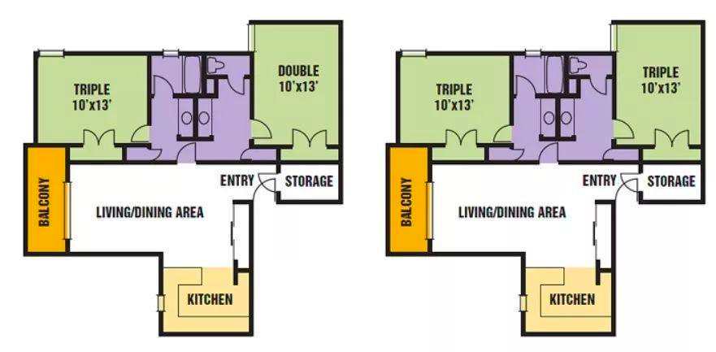

# Warren College

Earl Warren College ，简称Warren College，是 UCSD 的第四个学院，于 1974 年建立。Earl Warren 是著名政治家和法学家，曾担任过美国首席大法官与加州州长。受
Earl Warren 启发 ， Warren college 着重于不同学科之间的平衡，其宗旨是 “Toward a life in balance”。Warren College
希望学生毕业以后可以成为一个全面发展的人并进而为社会做出贡献，其 logo 天平，也体现了这个学院“平衡”的理念。Earl Warren
College - Wikipedia

## 地理位置及出行

Warren 处于学校的东部，距离Geisel library 和Price Center 都很近，而且包括了学校的大部分工程院楼，Warren Lecture
Hall（一个主要教学楼，可以上大型 lecture 和小型 discussion），以及“地牢”（CSE Lab，学校的机房），engineering 教学楼，所以上课会很方便。

## General Education （通识教育）

Warren College 的 GE 主要分为以下四个部分：

**Writing Requirements (WCWP)**

Warren College 的写作课是Warren college writing program（WCWP）10A 和10B。每学年WCWP 10A的主题都不一样，可以在warren
college官网找到具体的主题。10B的主题包括权益，迪士尼，教育等等种族，正义和大数据。话题都比较浅显易懂，写作文不难。

10A和10B的课程要求都是每周两次，小班课教育，没有discussion。但是和所有的写作课都一样，是课程要求mandatory attendance的，一学期缺席超过两次就不能拿A了。

WCWP的series都要求学生们每周进行材料阅读，要求用Perusall进行annotate。而写paper方面，一学期通常是两次paper的workload。但要求反复修改。

在官网也能找到对应学期任教的教授和每位教授教授的主题。10A和10B现在采取了grade
contract的模式。学生可以选择自己的最终成绩，但同时也要完成对应level要求的任务，总体来说还是比较好拿A的

**Ethics and Society**

在完成 WCWP 10A 和 10B 之后，Warren College 的学生还需要完成 Phil27 / Poli27 和 Phil28 / Poli28。相比于 WCWP，这两节课从阅读材料理解和写
paper 上都会更难一些。需要注意的是，该系列只能上 Letter Grade，不能P/NP。

接下来因为工程专业和非工程专业的差别，Warren College 的 GE 又有些许不同，分为工程专业的 Area Studies 和非工程专业的
Programs of Concentration。

这里需要提醒下大家，DATA SCIENCE，如上图所示，不算工程专业。当初怀着美好的愿望转到 DATA SCIENCE, 结果发现需要上 12 门 GE
（微笑.JPG）。

**Area Studies**

工程类专业学生要上的 GE，需要在专业之外的两个其他领域各选择一个专业上 3 节课。

**Programs of Concentration (PofCs)**

非工程专业学生要上的 GE，需要在专业之外的两个其他领域各选择一个专业上 6 节课，其中至少3节必须为UPPER DIVISION（高阶课程）。

## 学院宿舍
Warren College 的宿舍分为 Residential Hall（ResHall）和 apartment（apt）。只有大一新生可以申请入住ResHall，不过一般 ResHall
会比较挤，且没有厨房。

Warren College 一共有四栋 apt，提供分配的房型有双人间和三人间，相对来说床位还是比较多的，所以新生是很有可能被分配到
apt。大部分的新生会被分到离 Canyon Vista（食堂）近一点的 Douglas Hall，到大二的时候则会被分配到剩下三个 apt。

就 apt 来说，三人间有些挤，上铺离天花板比较近，只有有限的距离，不小心碰到还可能会把天花板上的墙皮蹭下来一些（...）。如果是双人间的话还不错，但是房内的空间也很有限，只是相较三人间好一些。一个
apt 有一个厨房，自带冰箱和柜子，但是厨具和微波炉需要自己购买或者与室友公用。

Warren College 的 apt 在圣诞假和春假的时候会允许住宿，但是在夏天放假的时候会关闭，同学们需要在 Final Week 那周周六搬出去。

## 学院生活
(a) **洗衣房**

洗衣房在 ResHall 和 一apt 的楼都会有一两间，一般在白天的时候洗衣房比较空，晚上的话可能要等一等。洗衣服是 $1.25 一次，烘干是
$1 一次，直接从 Triton Cash 里扣钱，建议第一次可以直接充 $50 左右，后面不够也可以再充。

(B) **快递 / 邮件收取 & 活动室**

Warren College 的宿舍区有一个 Student Activity Center，具体位置在 Black Hall 旁边，靠近马路。里面有乒乓球台，桌游，和一些Xbox、ps4
等游戏碟租借。里面还有一个小的mailroom 负责接取邮件和快递，需要带着自己的 student ID 去取快递。

(c) **自习室**

Warren College 有一个 24 小时向 Warren 学生开放的自习室叫 The Courtroom，具体位置在 Student Activity Center 旁边（和 CSE
Lab 相隔不到两百米）。该自习室每学期会更换一次密码，十分安全。

同时，超市旁边有一个没有门锁的大一点的自习室， 在EBU3B（CSE 楼）那里也有一个稍微小一点的自习室。

与此同时，Warren的食堂Canyon Vista的二楼，也是一个供给学习的地方。相对来说人不多。

## 食堂及超市

Warren 学院的食堂位于学院宿舍区，在整个UCSD的东北部

在经过翻修改造后，原本的earl‘s market 与Cayan Vista 合并成了（区域之间不设隔断，类似于一个大食堂的不同角落）

在HDH官网上可以查到这个食堂的每日菜单和工作时间

https://hdh-web.ucsd.edu/dining/apps/diningservices/Restaurants/MenuItem/24

下面就来康康新CV各个部分的样子吧

- (A) Fusion Grill
这个部分自带小小的超市区，包括常见的BURRITO 和 饮料。主营burrito以及早餐sandwich。可供选择的事物以及add-on
种类不算多，口味也是中规中矩。其中早餐与其他时候的菜单供应食物不同。

- (B) Three-Sixty
主营自选的BOWLS，有多种BASE，PROTEIN，和SIDES可供选择。另外在柜台也可以选特色的poke bowl，种类十分丰富。

- (C) Earl’s Coffee House
原先的earl‘s market 转移到了CV 一进门的地方， 货架上有各种食品以及生活用品。 柜台可以点咖啡以及其他冷饮热饮，
每天还有SPECIAL可供选择。

- (D) 用餐环境
在翻修后，CV的用餐环境变得更加舒适。内部装修很精致，小隔间以及茶几的摆放也让整个环境变得温馨。在户外用餐也可以享受到峡谷的自然风光。

CV在经过翻修后，面积扩大，种类也十分丰富。 对于住在warren 宿舍的同学们来说，CV确实是一个平常用餐的主要选择。
对于其他同学来说，CV也是一个跟朋友聊天吃饭的好地方。

## 附近设施
**Academic Advising Office**

Advising帮助的具体方面包括：探索或者更换专业，GE要求的具体细节，讨论一个四年的课程规划，添加第二个专业，添加一个 minor
等等。Warren College的 Academic Advising Office 在 EBU3B里面，疫情前可以通过 Walk-In 或者appointment 的方式与 advisor
交流。疫情后线下只有limited appointment。具体需联系waadvising@ucsd.edu。大部分advising在线上进行。可以通过Virtual Advising
Center (VAC) 向相关老师发消息，回复也可在VAC查看。可以在zoom上和老师聊。也可以向上文提到的邮箱发邮件询问。

**Fallen Star**

Fallen Star 是 Do Ho Suh 的艺术作品，位于 JACOBS ENGINEERING BUILDING
的顶楼，探讨了家庭的概念，文化的转移，人们对空间的感知和记忆。通过倾斜的房子和内部陈列，营造出一种熟悉又陌生的世界观。这也是
Stuart Collection 其中的一件作品。对外开放时间是每周二周四的下午十二点到两点，并无需提前预约。

**Bear**

Tim Hawkinson 的作品 Bear，通过由石头组成的熊，打破了人们对于童年玩具熊的柔软和舒适的固有印象。同时 Bear 也是 WARREN
COLLEGE 的吉祥物，周围环绕着的是 CSE 的教学楼。

{: .contribution}
> **致谢**
> 
> 文｜高伟航 
> 
> 修改｜徐星辰，姜天立，朱博奇，温馨雨, 
> 
> 编｜章闻珊 
> 
> 排版｜向都 
> 
> 图片来源｜留学在UCSD
>
> 搬运｜陈佳钰