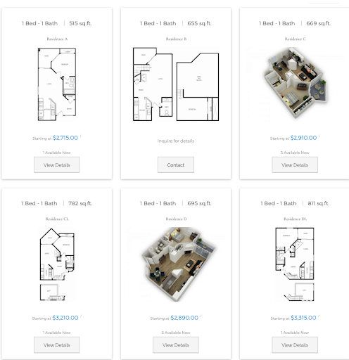
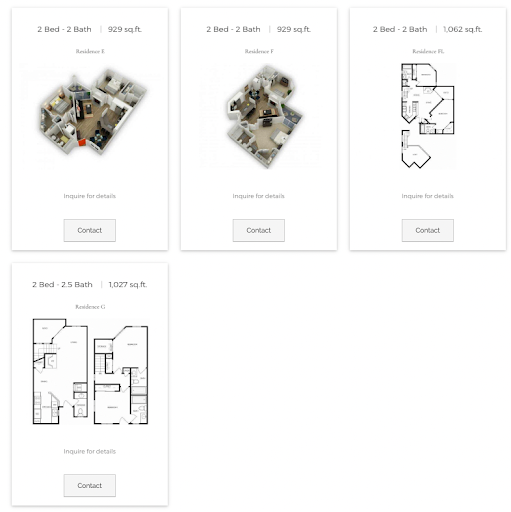

**房源介绍**

- 地址：3950 Mahaila Ave, San Diego, CA 92122

- Leasing Office: 855-742-2074

- 交通：距UCSD开车约10-15min，小区旁可乘坐237、41、201等公交车直达学校。

- 周围店铺：同上La Jolla Village商圈。

**房型及价格**

大致在$2,700 - $5,678 (由于租房价格浮动，仅举例介绍，具体请咨询Leasing office) :

2b2b今年价格普遍在 $3,500 – $5,678左右

评价：Axiom从15年起翻新了一批房子，如果想住这里的朋友们可以在看房子时顺便问一下是否有翻新后的空房，毕竟换了新设备的房子住着总会舒服一些。普遍的评价自从翻新以后就一直非常好，以往的评价也多在描述设备过于老旧，整体地理位置和其他几个小区一样优秀，小区环境也还算不错。apt里有in-unit
laundry，可以养宠物。