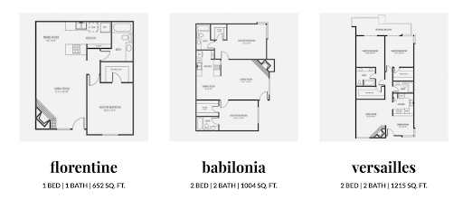

**房源介绍**

- 地址：3417 Lebon DrSan Diego, CA 92122

- Leasing Office: (858) 587-9997

- 交通：距UCSD开车约15-20min，小区旁可乘坐41、201、101、30等直达学校。

- 周围店铺：同上La Jolla Village商圈。

**房型及价格**

房价：今年 2b2b Babilonia房型价格是$2,545 - $3,655 左右，其余房型价格未找到（每年房价会略有波动，今年价格仅可参考）。这个小区和la
scala是同一个公司的，小区内设施等可参考la scala。

评价：房价较为便宜，所以设施方面也会差一些，整体设备较为老旧，屋内光线也不是很好，洗衣房为公用，车位也较小，大型车可能需要停在外面。这个小区每栋楼之间距离较近，建议去现场看房。同样的，和大多数小区一样，隔音效果差是一大问题，可以说住的舒适程度取决于你的邻居。但优点是离公交车站近，步行距离可以到达VONS。退房时也很少出现扣款现象（有很多公司会以各种理由扣去你的deposit）。按个人需求权衡决定。