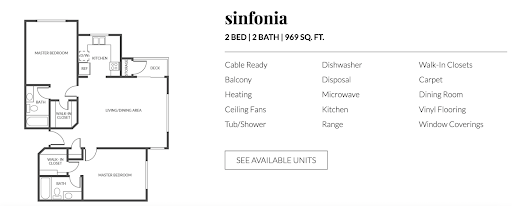
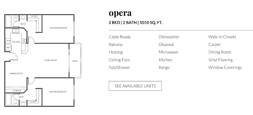

**房源介绍**

- 地址：3845 Nobel Dr, San Diego, CA 92122

- Leasing Office: 858-457-4444

- 交通：距离UCSD开车约9min, 小区旁可乘坐101、201、202、41、30等直达学校。

- 周围店铺：距离La Jolla Village近，附近有Ralph's、Whole Foods、AMC、CVS、Trader Joe's及不少餐厅。坐公交车去UTC也很方便。

**房型及价格**

2b2b sinfonia房型今年价格在 $3520 -3675左右, opera是在 $3520 -3675, 每年房价会略有浮动。小区里还有1b1b，目前未找到价格。

评价：房屋安静，几乎没有噪音问题；地理位置好，门口有很多条BUS线路； 维修速度快；有免费的打印服务；且处于La Jolla
Village附近，采买方便。房价较为便宜并且包水费，但没有in-unit laundry，需要去小区里的公共laundry room。

