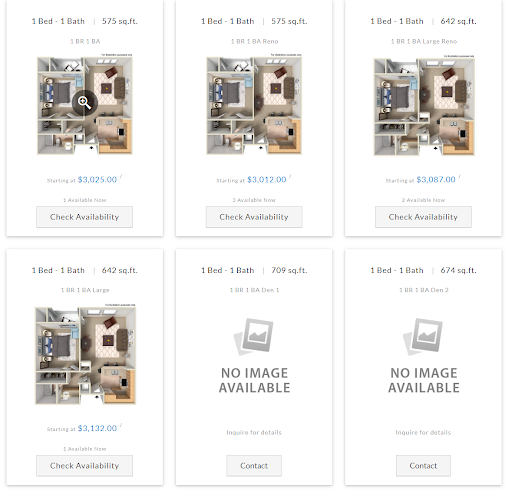

**房源介绍**

- 地址：3707 Nobel Dr, San Diego, CA 92122

- Leasing Office: (844) 941-0871

- 交通：距UCSD开车约10-15min，小区旁可乘坐30、101、202、41、201等直达学校。

- 周围店铺：距离La Jolla Village近，附近有Ralph's、Whole Foods、AMC、CVS、Trader Joe's及不少餐厅。坐公交车去UTC也很方便。

**房型及价格**

房型： 1B1B, 2B2B
(由于租房价格浮动且房型剩余未知，仅举例介绍，具体请咨询Leasing office)：

评价：总评一般，有好有坏，发生过车子盗抢事件（不过车辆盗抢在SD似乎整体发生的频率都比较高），房屋隔音效果不好等都被投诉过，但也有很多好评，主要因为地理位置优越，距离超市学校都不是很远，2B2B类型的房子的储存空间够大，同时工作人员服务态度也都很不错。

