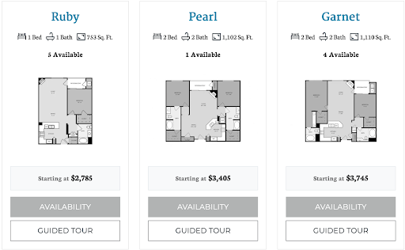
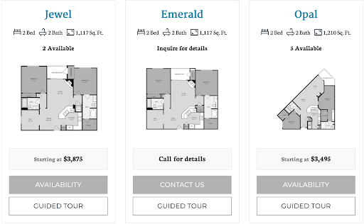

**房源介绍**

- 地理位置：9253 Regents Road La Jolla

- 可选房型：1B1B / 2B2B

- 价格区间： $2785-3875

- 房屋设施：洗衣机/烘干机，阳台，洗碗机，微波炉，炉灶，冰箱

- 小区设施：电影院、健身房、游泳池、烧烤区

- 周围店铺：Regents Plaza：Starbucks，Nozomi Sushi，Regents Pizzeria。走路10分钟到UTC

- 交通：小区旁有公交车站，30, 41, 201, 101可到达学校

**房型及价格**

该小区提供6种房型可供选择，具体信息如下
http://www.regentslajolla.net/floorplans/#availabilities/

*价格可能有所偏差，具体请询问小区leasing office

评价：一个价格非常高，房子面积比较小的小区（OPAL和SAPPHIRE的面积还算好）。不过贵的小区一般都比较好，一分价钱一分货。小区的设施很精致，绿化也很好，有大门，所以比较安全。房子里都是木地板，清洁起来会比较方便。

**居住体验与Q&A**

- 交通便捷指数：10

- 安全指数：10

- 性价比：9

---

- Q：刚拿到房子的时候是什么状态呢？

- A：整套房子都是木地板。硬装包括：冰箱、微波炉、烤箱、洗碗机、洗衣机、烘干机。

---

- Q：各个房间相对大小怎么样呢？

- A：客厅很大，厨房也挺大，房间相对比较小，因为walk-in closet和厕所占了一部分空间。

---

- Q：隔音效果好吗？

- A：房间和客厅一般，但是如果是2b两间屋子的隔音还是挺好的，也不太听得到隔壁声音。楼上楼下不确定因为我住顶楼。

---

- Q：小区配套设施的使用感受怎么样呢？

-

A：有个电影院会放最近几个月上映的电影，有自助爆米花。有台球桌。有两个泳池，泳池比较浅适合小朋友，不过应该和其他小区一样。有烧烤架，挺好用的。租客还可以借公共厨房和cabana办趴，十几刀一小时。有两个健身房，不过都不大，有基础有氧和很少的举铁器材。

---

- Q：LEASING OFFICE 办事效率如何？

- A：之前可以网上报修所有东西，灯泡坏了水管堵了之类的，一般两个工作日处理好。office能代收包裹，帮忙退货。

---

- Q：能养宠物吗？

- A：能养宠物，可能需要额外付宠物租金。

---

- Q：安全性怎么样呢？

- A：小区完全封闭，车库和地面都有铁门，也有人24小时巡逻。

---

- Q：周边交通便捷吗？

- A：交通很方便，有公交车可以直接到学校。