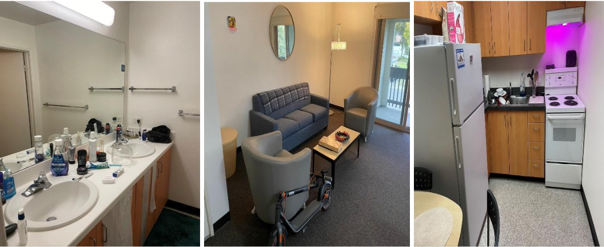

从2022年暑假开始，Pepper Canyon West进行construction，翻新重建。预计2024年完成施工。但Matthew‘s Apartment暂时不受影响还在继续使用。
##  宿舍地理位置及出行
主要是旧六院的宿舍区，位于学校东侧边缘地带。离UCSD blueline轻轨车站较近。
##  宿舍区

宿舍区例如Matthew’s apartment主要属于apartment户型，一般6个人一个house，每个house包含单人间双人间以及三人间。由于疫情缘故，暂时三人间改为了双人间。基本的厨房家电比较充足包括冰箱，烤箱以及微波炉。非常能满足喜欢做饭的学生的需求。

## 宿舍生活
### 洗衣房
Matthew's Apartment会有2-3个洗衣服分布在不同地区，按照地理位置的便利，可以选择离自己最近的洗衣房。
### 自习室
会有自习室分布在洗衣房以及foodwox附近。平时想要安静的学习环境的话是不错的选择。
### 健身房
健身房一般位于学校的revelle学院 main gym和RIMAC。从pepper canyon走路到这些健身房大概需要15min左右的路程
### 快递/邮件收取
快递主要位于学校的trove也就是library walk的路边专门收集package的地方， 比较像国内的蜂巢，可以用自己的学生ID刷一下，或者用email里收到的二维码就能打开柜子。也有些大件的快递需要从前台用学生ID去领。
### 周边超市食堂
周围只有一家超市foodwox，里面包含类似pizza或者一些whole food的食物。也有生活平常需要的日用品。如果平时想吃食堂可以选择从pc loop那条路到学校price center吃饭。 里面的选择比较多也有基本的panda express和汉堡王等餐厅。 

### 附近设施
Pepper canyon周围交通便利 步程5min就会有环绕校园的公交车以及周游sd的小火车。并且会配有网球场，篮球场，停车场在附近。