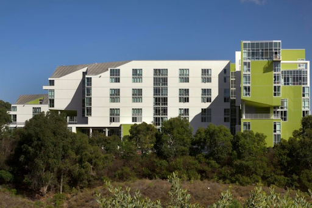
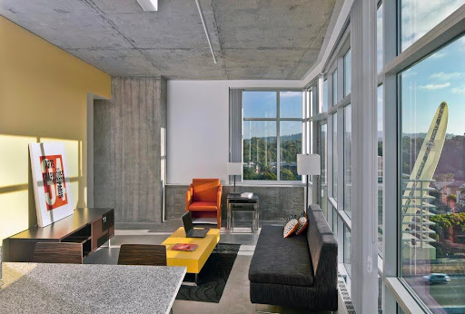

以往是两人一间，每人一个单间。现改为四人一间，两人一个mini double。
新学期以选宿舍的实际情况为准。
多为transfer宿舍，新生不太会住在这里。

##  宿舍地理位置及出行
Rita Atkinson整体位于ucsd南部，处于revelle和主校区之间， 被biomedical的各个实验楼包围。
公交站：楼下十字路口，center hall所处的马路
停车： 靠近Osler Parking Structure
##  宿舍区

图片仅供参考，毕竟有这么大窗户的房间不多。设施基本如图。
卧室双人间是上下床，上床距离天花板比较近。单人间很舒服，双人间有些拥挤。

## 宿舍生活
### 洗衣房
公用大洗衣房，且不是每层都有。刷triton cash使用，需要提前充值。
### 自习室
24小时开放
### 健身房
四楼有一个小健身房
### 快递/邮件收取
由前台代收。以自己的mailbox number取件
### 周边超市食堂
走路十分钟到Whole foods和Ralphs，五分钟到学校target。附近没有大食堂
### 附近设施
Biomedical Library， 现已更名为WongAvery Library。Biomedical，Pharmaceutical以及相关医学院的实验楼

